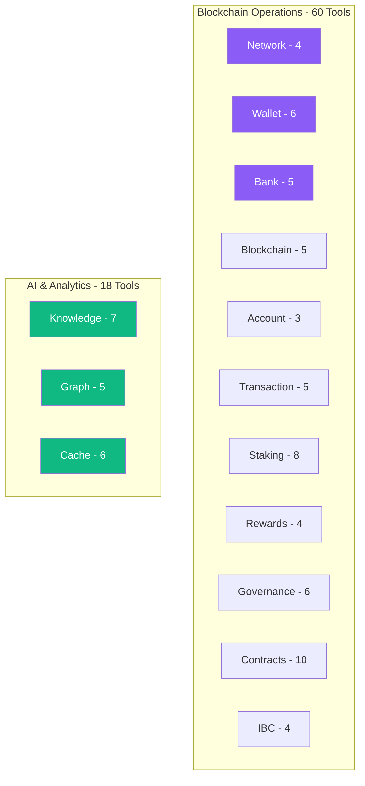

# API.md

# 🔧 SecretAgent API Reference

**Complete Documentation for All 78 MCP Tools**

This document provides comprehensive API documentation for all tools available in the SecretAgent MCP server.

---

## Table of Contents

1. [Overview](#overview)
2. [Tool Categories](#tool-categories)
3. [Common Patterns](#common-patterns)
4. [Network Tools (4)](#network-tools)
5. [Wallet Tools (6)](#wallet-tools)
6. [Bank Tools (5)](#bank-tools)
7. [Blockchain Tools (5)](#blockchain-tools)
8. [Account Tools (3)](#account-tools)
9. [Transaction Tools (5)](#transaction-tools)
10. [Staking Tools (8)](#staking-tools)
11. [Rewards Tools (4)](#rewards-tools)
12. [Governance Tools (6)](#governance-tools)
13. [Contract Tools (10)](#contract-tools)
14. [IBC Tools (4)](#ibc-tools)
15. [Knowledge Tools (7)](#knowledge-tools)
16. [Graph Tools (5)](#graph-tools)
17. [Cache Tools (6)](#cache-tools)
18. [Error Handling](#error-handling)
19. [Rate Limits](#rate-limits)
20. [Examples](#examples)

---

## Overview

SecretAgent provides **78 MCP (Model Context Protocol) tools** organized into 14 categories. All tools follow a consistent interface pattern and return standardized responses.

### Tool Execution

```python
# Using Python SDK
result = await mcp_server.execute_tool(
    tool_name="secret_get_balance",
    parameters={"address": "secret1..."}
)

# Using REST API (if enabled)
POST /api/v1/tools/execute
{
    "tool": "secret_get_balance",
    "params": {
        "address": "secret1..."
    }
}
```

### Response Format

All tools return a consistent response structure:

```typescript
interface ToolResult {
    ok: boolean;              // Success/failure flag
    data?: object;            // Result data (if successful)
    error?: string;           // Error message (if failed)
    message: string;          // Human-readable message
}
```

### Success Response

```json
{
    "ok": true,
    "data": {
        "balance": "1234567890",
        "denom": "uscrt"
    },
    "message": "Balance retrieved successfully"
}
```

### Error Response

```json
{
    "ok": false,
    "error": "Address not found",
    "message": "Failed to retrieve balance"
}
```

---

## Tool Categories



| Category        | Tools | Purpose                              |
| --------------- | ----- | ------------------------------------ |
| **Network**     | 4     | Network configuration and status     |
| **Wallet**      | 6     | Wallet management                    |
| **Bank**        | 5     | Token operations                     |
| **Blockchain**  | 5     | Block and node queries               |
| **Account**     | 3     | Account information                  |
| **Transaction** | 5     | Transaction queries                  |
| **Staking**     | 8     | Delegation and staking               |
| **Rewards**     | 4     | Reward management                    |
| **Governance**  | 6     | Proposal voting                      |
| **Contracts**   | 10    | Smart contract operations            |
| **IBC**         | 4     | Inter-blockchain communication       |
| **Knowledge**   | 7     | Semantic search and knowledge base   |
| **Graph**       | 5     | Network analysis and recommendations |
| **Cache**       | 6     | Cache management                     |

---

## Common Patterns

### Address Format

Secret Network uses Bech32 encoded addresses:

```typescript
// Wallet addresses
"secret1" + 38 characters
Example: "secret1ap26qrlp8mcq2pg6r47w43l0y8zkqm8a450s03"

// Validator addresses
"secretvaloper1" + 38 characters
Example: "secretvaloper1ap26qrlp8mcq2pg6r47w43l0y8zkqm8a4n0l4m"

// Contract addresses
"secret1" + 38 characters (same format as wallets)
```

### Amount Format

Token amounts are specified in **micro-units** (uscrt):

```typescript
1 SCRT = 1,000,000 uscrt

Examples:
"1000000" = 1 SCRT
"5500000" = 5.5 SCRT
"100000000" = 100 SCRT
```

### Pagination

Tools that return lists support pagination:

```typescript
{
    "limit": 50,        // Number of results per page
    "offset": 0,        // Starting position
    "reverse": false    // Reverse order
}
```

---

## Network Tools

### 1. secret_configure_network

Configure the Secret Network connection (testnet, mainnet, or custom).

**Parameters:**

```typescript
{
    network: "testnet" | "mainnet" | "custom"
}
```

**Response:**

```typescript
{
    ok: boolean,
    data: {
        network: string,
        chain_id: string,
        rpc_url: string,
        lcd_url: string
    },
    message: string
}
```

**Example:**

```python
result = await mcp_server.execute_tool(
    "secret_configure_network",
    {"network": "testnet"}
)
```

**Example Response:**

```json
{
    "ok": true,
    "data": {
        "network": "testnet",
        "chain_id": "pulsar-3",
        "rpc_url": "https://rpc.testnet.secretsaturn.net",
        "lcd_url": "https://lcd.testnet.secretsaturn.net"
    },
    "message": "Network configured successfully"
}
```

---

### 2. secret_get_network_info

Get current network information including chain ID and endpoints.

**Parameters:** None

**Response:**

```typescript
{
    ok: boolean,
    data: {
        network: string,
        chain_id: string,
        rpc_url: string,
        lcd_url: string,
        bech32_prefix: string
    },
    message: string
}
```

**Example:**

```python
result = await mcp_server.execute_tool("secret_get_network_info", {})
```

**Example Response:**

```json
{
    "ok": true,
    "data": {
        "network": "testnet",
        "chain_id": "pulsar-3",
        "rpc_url": "https://rpc.testnet.secretsaturn.net",
        "lcd_url": "https://lcd.testnet.secretsaturn.net",
        "bech32_prefix": "secret"
    },
    "message": "Network info retrieved"
}
```

---

### 3. secret_get_gas_prices

Get current gas prices for the network.

**Parameters:** None

**Response:**

```typescript
{
    ok: boolean,
    data: {
        gas_price: string,      // Price in uscrt
        denom: string           // "uscrt"
    },
    message: string
}
```

**Example:**

```python
result = await mcp_server.execute_tool("secret_get_gas_prices", {})
```

**Example Response:**

```json
{
    "ok": true,
    "data": {
        "gas_price": "0.25",
        "denom": "uscrt"
    },
    "message": "Gas prices retrieved"
}
```

---

### 4. secret_health_check

Check the health status of the Secret Network node connection.

**Parameters:** None

**Response:**

```typescript
{
    ok: boolean,
    data: {
        status: "healthy" | "unhealthy",
        rpc_connected: boolean,
        lcd_connected: boolean,
        syncing: boolean,
        latest_block_height: number
    },
    message: string
}
```

**Example:**

```python
result = await mcp_server.execute_tool("secret_health_check", {})
```

**Example Response:**

```json
{
    "ok": true,
    "data": {
        "status": "healthy",
        "rpc_connected": true,
        "lcd_connected": true,
        "syncing": false,
        "latest_block_height": 12345678
    },
    "message": "Network is healthy"
}
```

---

## Wallet Tools

### 5. secret_create_wallet

Create a new HD wallet with a generated mnemonic.

**Parameters:**

```typescript
{
    name: string  // Unique wallet name
}
```

**Response:**

```typescript
{
    ok: boolean,
    data: {
        name: string,
        address: string,
        mnemonic: string,  // 24-word seed phrase - SAVE SECURELY!
        pub_key: string
    },
    message: string
}
```

**Example:**

```python
result = await mcp_server.execute_tool(
    "secret_create_wallet",
    {"name": "my-wallet"}
)
```

**Example Response:**

```json
{
    "ok": true,
    "data": {
        "name": "my-wallet",
        "address": "secret1ap26qrlp8mcq2pg6r47w43l0y8zkqm8a450s03",
        "mnemonic": "word1 word2 word3 ... word24",
        "pub_key": "A+vZ..."
    },
    "message": "Wallet created successfully. SAVE YOUR MNEMONIC!"
}
```

⚠️ **Security Warning:** Store the mnemonic securely! It's the only way to recover your wallet.

---

### 6. secret_import_wallet

Import an existing wallet using a mnemonic phrase.

**Parameters:**

```typescript
{
    name: string,      // Unique wallet name
    mnemonic: string   // 12 or 24 word mnemonic phrase
}
```

**Response:**

```typescript
{
    ok: boolean,
    data: {
        name: string,
        address: string,
        pub_key: string
    },
    message: string
}
```

**Example:**

```python
result = await mcp_server.execute_tool(
    "secret_import_wallet",
    {
        "name": "imported-wallet",
        "mnemonic": "word1 word2 word3 ... word24"
    }
)
```

**Example Response:**

```json
{
    "ok": true,
    "data": {
        "name": "imported-wallet",
        "address": "secret1xyzabc...",
        "pub_key": "A+vZ..."
    },
    "message": "Wallet imported successfully"
}
```

---

### 7. secret_set_active_wallet

Set the active wallet for operations.

**Parameters:**

```typescript
{
    name: string  // Name of wallet to activate
}
```

**Response:**

```typescript
{
    ok: boolean,
    data: {
        name: string,
        address: string
    },
    message: string
}
```

**Example:**

```python
result = await mcp_server.execute_tool(
    "secret_set_active_wallet",
    {"name": "my-wallet"}
)
```

---

### 8. secret_get_active_wallet

Get the currently active wallet.

**Parameters:** None

**Response:**

```typescript
{
    ok: boolean,
    data: {
        name: string,
        address: string,
        pub_key: string
    },
    message: string
}
```

**Example:**

```python
result = await mcp_server.execute_tool("secret_get_active_wallet", {})
```

---

### 9. secret_list_wallets

List all loaded wallets in the session.

**Parameters:** None

**Response:**

```typescript
{
    ok: boolean,
    data: {
        wallets: Array<{
            name: string,
            address: string,
            is_active: boolean
        }>,
        count: number
    },
    message: string
}
```

**Example:**

```python
result = await mcp_server.execute_tool("secret_list_wallets", {})
```

**Example Response:**

```json
{
    "ok": true,
    "data": {
        "wallets": [
            {
                "name": "wallet1",
                "address": "secret1abc...",
                "is_active": true
            },
            {
                "name": "wallet2",
                "address": "secret1xyz...",
                "is_active": false
            }
        ],
        "count": 2
    },
    "message": "Found 2 wallets"
}
```

---

### 10. secret_remove_wallet

Remove a wallet from the session.

**Parameters:**

```typescript
{
    name: string  // Name of wallet to remove
}
```

**Response:**

```typescript
{
    ok: boolean,
    data: {
        name: string,
        removed: boolean
    },
    message: string
}
```

**Example:**

```python
result = await mcp_server.execute_tool(
    "secret_remove_wallet",
    {"name": "old-wallet"}
)
```

---

## Bank Tools

### 11. secret_get_balance

Get token balances for an address.

**Parameters:**

```typescript
{
    address?: string  // Optional, uses active wallet if not provided
}
```

**Response:**

```typescript
{
    ok: boolean,
    data: {
        address: string,
        balances: Array<{
            denom: string,
            amount: string  // In micro-units
        }>
    },
    message: string
}
```

**Example:**

```python
result = await mcp_server.execute_tool(
    "secret_get_balance",
    {"address": "secret1ap26qrlp8mcq2pg6r47w43l0y8zkqm8a450s03"}
)
```

**Example Response:**

```json
{
    "ok": true,
    "data": {
        "address": "secret1ap26qrlp8mcq2pg6r47w43l0y8zkqm8a450s03",
        "balances": [
            {
                "denom": "uscrt",
                "amount": "1234567890"
            }
        ]
    },
    "message": "Balance: 1234.567890 SCRT"
}
```

---

### 12. secret_send_tokens

Send tokens to another address.

**Parameters:**

```typescript
{
    recipient: string,      // Recipient address
    amount: string,         // Amount in micro-units
    denom?: string,         // Default: "uscrt"
    memo?: string           // Optional transaction memo
}
```

**Response:**

```typescript
{
    ok: boolean,
    data: {
        tx_hash: string,
        height: number,
        gas_used: number,
        gas_wanted: number
    },
    message: string
}
```

**Example:**

```python
result = await mcp_server.execute_tool(
    "secret_send_tokens",
    {
        "recipient": "secret1xyz...",
        "amount": "1000000",  # 1 SCRT
        "memo": "Payment for services"
    }
)
```

**Example Response:**

```json
{
    "ok": true,
    "data": {
        "tx_hash": "ABC123DEF456...",
        "height": 12345678,
        "gas_used": 89234,
        "gas_wanted": 100000
    },
    "message": "Sent 1.000000 SCRT successfully"
}
```

---

### 13. secret_multi_send

Send tokens to multiple recipients in a single transaction.

**Parameters:**

```typescript
{
    recipients: Array<{
        address: string,
        amount: string,
        denom?: string  // Default: "uscrt"
    }>
}
```

**Response:**

```typescript
{
    ok: boolean,
    data: {
        tx_hash: string,
        height: number,
        recipients_count: number,
        total_sent: string
    },
    message: string
}
```

**Example:**

```python
result = await mcp_server.execute_tool(
    "secret_multi_send",
    {
        "recipients": [
            {"address": "secret1abc...", "amount": "1000000"},
            {"address": "secret1xyz...", "amount": "2000000"}
        ]
    }
)
```

---

### 14. secret_get_total_supply

Get the total supply of tokens.

**Parameters:**

```typescript
{
    denom?: string  // Optional, returns all if not specified
}
```

**Response:**

```typescript
{
    ok: boolean,
    data: {
        supply: Array<{
            denom: string,
            amount: string
        }>
    },
    message: string
}
```

**Example:**

```python
result = await mcp_server.execute_tool(
    "secret_get_total_supply",
    {"denom": "uscrt"}
)
```

---

### 15. secret_get_denom_metadata

Get metadata for a token denomination.

**Parameters:**

```typescript
{
    denom: string  // Token denomination
}
```

**Response:**

```typescript
{
    ok: boolean,
    data: {
        metadata: {
            description: string,
            denom_units: Array<{
                denom: string,
                exponent: number,
                aliases: string[]
            }>,
            base: string,
            display: string,
            name: string,
            symbol: string
        }
    },
    message: string
}
```

**Example:**

```python
result = await mcp_server.execute_tool(
    "secret_get_denom_metadata",
    {"denom": "uscrt"}
)
```

---

## Blockchain Tools

### 16. secret_get_block

Get block information by height.

**Parameters:**

```typescript
{
    height: number  // Block height
}
```

**Response:**

```typescript
{
    ok: boolean,
    data: {
        block: {
            header: {
                height: number,
                time: string,
                chain_id: string,
                proposer_address: string
            },
            data: {
                txs: string[]  // Transaction hashes
            }
        }
    },
    message: string
}
```

**Example:**

```python
result = await mcp_server.execute_tool(
    "secret_get_block",
    {"height": 12345678}
)
```

---

### 17. secret_get_latest_block

Get the latest block information.

**Parameters:** None

**Response:**

```typescript
{
    ok: boolean,
    data: {
        height: number,
        time: string,
        chain_id: string,
        proposer_address: string,
        tx_count: number
    },
    message: string
}
```

**Example:**

```python
result = await mcp_server.execute_tool("secret_get_latest_block", {})
```

**Example Response:**

```json
{
    "ok": true,
    "data": {
        "height": 12345678,
        "time": "2024-01-15T12:34:56.789Z",
        "chain_id": "pulsar-3",
        "proposer_address": "secretvalcons1...",
        "tx_count": 42
    },
    "message": "Latest block: 12345678"
}
```

---

### 18. secret_get_block_by_hash

Get block information by hash.

**Parameters:**

```typescript
{
    block_hash: string  // Block hash (hex)
}
```

**Response:** Same as `secret_get_block`

**Example:**

```python
result = await mcp_server.execute_tool(
    "secret_get_block_by_hash",
    {"block_hash": "ABC123DEF456..."}
)
```

---

### 19. secret_get_node_info

Get information about the connected node.

**Parameters:** None

**Response:**

```typescript
{
    ok: boolean,
    data: {
        node_info: {
            protocol_version: {
                p2p: string,
                block: string,
                app: string
            },
            id: string,
            listen_addr: string,
            network: string,
            version: string,
            channels: string,
            moniker: string
        }
    },
    message: string
}
```

**Example:**

```python
result = await mcp_server.execute_tool("secret_get_node_info", {})
```

---

### 20. secret_get_syncing_status

Get the syncing status of the node.

**Parameters:** None

**Response:**

```typescript
{
    ok: boolean,
    data: {
        syncing: boolean,
        latest_block_height: number,
        latest_block_time: string
    },
    message: string
}
```

**Example:**

```python
result = await mcp_server.execute_tool("secret_get_syncing_status", {})
```

---

## Account Tools

### 21. secret_get_account

Get account information including sequence and account number.

**Parameters:**

```typescript
{
    address: string  // Secret Network address
}
```

**Response:**

```typescript
{
    ok: boolean,
    data: {
        account: {
            address: string,
            pub_key: string,
            account_number: number,
            sequence: number
        }
    },
    message: string
}
```

**Example:**

```python
result = await mcp_server.execute_tool(
    "secret_get_account",
    {"address": "secret1ap26qrlp8mcq2pg6r47w43l0y8zkqm8a450s03"}
)
```

---

### 22. secret_get_account_transactions

Get transactions for an account.

**Parameters:**

```typescript
{
    address: string,
    limit?: number  // Default: 100
}
```

**Response:**

```typescript
{
    ok: boolean,
    data: {
        transactions: Array<{
            hash: string,
            height: number,
            tx: object,
            result: object
        }>,
        count: number
    },
    message: string
}
```

**Example:**

```python
result = await mcp_server.execute_tool(
    "secret_get_account_transactions",
    {
        "address": "secret1ap26qrlp8mcq2pg6r47w43l0y8zkqm8a450s03",
        "limit": 50
    }
)
```

---

### 23. secret_get_account_tx_count

Get the total transaction count for an account.

**Parameters:**

```typescript
{
    address: string  // Secret Network address
}
```

**Response:**

```typescript
{
    ok: boolean,
    data: {
        address: string,
        tx_count: number
    },
    message: string
}
```

**Example:**

```python
result = await mcp_server.execute_tool(
    "secret_get_account_tx_count",
    {"address": "secret1ap26qrlp8mcq2pg6r47w43l0y8zkqm8a450s03"}
)
```

---

## Transaction Tools

### 24. secret_get_transaction

Get transaction by hash.

**Parameters:**

```typescript
{
    tx_hash: string  // Transaction hash
}
```

**Response:**

```typescript
{
    ok: boolean,
    data: {
        hash: string,
        height: number,
        tx: object,
        tx_result: {
            code: number,
            log: string,
            gas_wanted: number,
            gas_used: number,
            events: array
        }
    },
    message: string
}
```

**Example:**

```python
result = await mcp_server.execute_tool(
    "secret_get_transaction",
    {"tx_hash": "ABC123DEF456..."}
)
```

---

### 25. secret_search_transactions

Search for transactions matching a query.

**Parameters:**

```typescript
{
    query: string,    // Search query (e.g., "message.sender='secret1...'")
    limit?: number    // Default: 100
}
```

**Response:**

```typescript
{
    ok: boolean,
    data: {
        transactions: Array<object>,
        count: number
    },
    message: string
}
```

**Example:**

```python
result = await mcp_server.execute_tool(
    "secret_search_transactions",
    {
        "query": "message.sender='secret1ap26qrlp8mcq2pg6r47w43l0y8zkqm8a450s03'",
        "limit": 50
    }
)
```

---

### 26. secret_estimate_gas

Estimate gas for messages.

**Parameters:**

```typescript
{
    messages: Array<object>  // Array of messages to estimate
}
```

**Response:**

```typescript
{
    ok: boolean,
    data: {
        gas_estimate: number
    },
    message: string
}
```

**Example:**

```python
result = await mcp_server.execute_tool(
    "secret_estimate_gas",
    {
        "messages": [
            {
                "type": "cosmos-sdk/MsgSend",
                "value": {...}
            }
        ]
    }
)
```

---

### 27. secret_simulate_transaction

Simulate a transaction without broadcasting.

**Parameters:**

```typescript
{
    messages: Array<object>  // Array of messages to simulate
}
```

**Response:**

```typescript
{
    ok: boolean,
    data: {
        gas_used: number,
        result: object
    },
    message: string
}
```

**Example:**

```python
result = await mcp_server.execute_tool(
    "secret_simulate_transaction",
    {
        "messages": [...]
    }
)
```

---

### 28. secret_get_transaction_status

Get the status of a transaction.

**Parameters:**

```typescript
{
    tx_hash: string  // Transaction hash
}
```

**Response:**

```typescript
{
    ok: boolean,
    data: {
        status: "pending" | "success" | "failed",
        height: number,
        code: number
    },
    message: string
}
```

**Example:**

```python
result = await mcp_server.execute_tool(
    "secret_get_transaction_status",
    {"tx_hash": "ABC123DEF456..."}
)
```

---

## Staking Tools

### 29. secret_get_validators

Get list of validators.

**Parameters:**

```typescript
{
    status?: string  // Optional: "BOND_STATUS_BONDED" | "BOND_STATUS_UNBONDED"
}
```

**Response:**

```typescript
{
    ok: boolean,
    data: {
        validators: Array<{
            operator_address: string,
            consensus_pubkey: string,
            jailed: boolean,
            status: string,
            tokens: string,
            delegator_shares: string,
            description: {
                moniker: string,
                identity: string,
                website: string,
                details: string
            },
            commission: {
                commission_rates: {
                    rate: string,
                    max_rate: string,
                    max_change_rate: string
                }
            }
        }>,
        count: number
    },
    message: string
}
```

**Example:**

```python
result = await mcp_server.execute_tool(
    "secret_get_validators",
    {"status": "BOND_STATUS_BONDED"}
)
```

**Example Response:**

```json
{
    "ok": true,
    "data": {
        "validators": [
            {
                "operator_address": "secretvaloper1...",
                "status": "BOND_STATUS_BONDED",
                "tokens": "1234567890000",
                "description": {
                    "moniker": "Validator A",
                    "website": "https://validator-a.com"
                },
                "commission": {
                    "commission_rates": {
                        "rate": "0.050000000000000000",
                        "max_rate": "0.200000000000000000",
                        "max_change_rate": "0.010000000000000000"
                    }
                }
            }
        ],
        "count": 50
    },
    "message": "Found 50 validators"
}
```

---

### 30. secret_get_validator

Get information about a specific validator.

**Parameters:**

```typescript
{
    validator_address: string  // Validator operator address
}
```

**Response:** Same structure as single validator from `secret_get_validators`

**Example:**

```python
result = await mcp_server.execute_tool(
    "secret_get_validator",
    {"validator_address": "secretvaloper1..."}
)
```

---

### 31. secret_delegate

Delegate tokens to a validator.

**Parameters:**

```typescript
{
    validator_address: string,  // Validator operator address
    amount: string              // Amount in micro-units
}
```

**Response:**

```typescript
{
    ok: boolean,
    data: {
        tx_hash: string,
        height: number,
        validator_address: string,
        amount: string
    },
    message: string
}
```

**Example:**

```python
result = await mcp_server.execute_tool(
    "secret_delegate",
    {
        "validator_address": "secretvaloper1...",
        "amount": "1000000"  # 1 SCRT
    }
)
```

**Example Response:**

```json
{
    "ok": true,
    "data": {
        "tx_hash": "ABC123...",
        "height": 12345678,
        "validator_address": "secretvaloper1...",
        "amount": "1000000"
    },
    "message": "Delegated 1.000000 SCRT successfully"
}
```

---

### 32. secret_undelegate

Undelegate tokens from a validator.

**Parameters:**

```typescript
{
    validator_address: string,  // Validator operator address
    amount: string              // Amount in micro-units
}
```

**Response:**

```typescript
{
    ok: boolean,
    data: {
        tx_hash: string,
        height: number,
        validator_address: string,
        amount: string,
        completion_time: string  // When tokens will be available
    },
    message: string
}
```

**Example:**

```python
result = await mcp_server.execute_tool(
    "secret_undelegate",
    {
        "validator_address": "secretvaloper1...",
        "amount": "500000"  # 0.5 SCRT
    }
)
```

⚠️ **Note:** Unbonding takes 21 days on Secret Network.

---

### 33. secret_redelegate

Redelegate tokens from one validator to another.

**Parameters:**

```typescript
{
    src_validator: string,  // Source validator address
    dst_validator: string,  // Destination validator address
    amount: string          // Amount in micro-units
}
```

**Response:**

```typescript
{
    ok: boolean,
    data: {
        tx_hash: string,
        height: number,
        src_validator: string,
        dst_validator: string,
        amount: string,
        completion_time: string
    },
    message: string
}
```

**Example:**

```python
result = await mcp_server.execute_tool(
    "secret_redelegate",
    {
        "src_validator": "secretvaloper1abc...",
        "dst_validator": "secretvaloper1xyz...",
        "amount": "1000000"
    }
)
```

---

### 34. secret_get_delegations

Get delegations for an address.

**Parameters:**

```typescript
{
    address?: string  // Optional, uses active wallet if not provided
}
```

**Response:**

```typescript
{
    ok: boolean,
    data: {
        delegations: Array<{
            delegator_address: string,
            validator_address: string,
            shares: string,
            balance: {
                denom: string,
                amount: string
            }
        }>,
        count: number
    },
    message: string
}
```

**Example:**

```python
result = await mcp_server.execute_tool(
    "secret_get_delegations",
    {"address": "secret1ap26qrlp8mcq2pg6r47w43l0y8zkqm8a450s03"}
)
```

**Example Response:**

```json
{
    "ok": true,
    "data": {
        "delegations": [
            {
                "delegator_address": "secret1ap26qrlp8mcq2pg6r47w43l0y8zkqm8a450s03",
                "validator_address": "secretvaloper1...",
                "shares": "1000000.000000000000000000",
                "balance": {
                    "denom": "uscrt",
                    "amount": "1000000"
                }
            }
        ],
        "count": 1
    },
    "message": "Found 1 delegation"
}
```

---

### 35. secret_get_unbonding

Get unbonding delegations for an address.

**Parameters:**

```typescript
{
    address?: string  // Optional, uses active wallet if not provided
}
```

**Response:**

```typescript
{
    ok: boolean,
    data: {
        unbonding_delegations: Array<{
            delegator_address: string,
            validator_address: string,
            entries: Array<{
                creation_height: number,
                completion_time: string,
                initial_balance: string,
                balance: string
            }>
        }>,
        count: number
    },
    message: string
}
```

**Example:**

```python
result = await mcp_server.execute_tool(
    "secret_get_unbonding",
    {"address": "secret1ap26qrlp8mcq2pg6r47w43l0y8zkqm8a450s03"}
)
```

---

### 36. secret_get_redelegations

Get redelegations for an address.

**Parameters:**

```typescript
{
    address?: string  // Optional, uses active wallet if not provided
}
```

**Response:**

```typescript
{
    ok: boolean,
    data: {
        redelegations: Array<{
            delegator_address: string,
            validator_src_address: string,
            validator_dst_address: string,
            entries: Array<{
                creation_height: number,
                completion_time: string,
                initial_balance: string,
                shares_dst: string
            }>
        }>,
        count: number
    },
    message: string
}
```

**Example:**

```python
result = await mcp_server.execute_tool(
    "secret_get_redelegations",
    {"address": "secret1ap26qrlp8mcq2pg6r47w43l0y8zkqm8a450s03"}
)
```

---

## Rewards Tools

### 37. secret_get_rewards

Get staking rewards for an address.

**Parameters:**

```typescript
{
    address?: string  // Optional, uses active wallet if not provided
}
```

**Response:**

```typescript
{
    ok: boolean,
    data: {
        rewards: Array<{
            validator_address: string,
            reward: Array<{
                denom: string,
                amount: string
            }>
        }>,
        total: Array<{
            denom: string,
            amount: string
        }>
    },
    message: string
}
```

**Example:**

```python
result = await mcp_server.execute_tool(
    "secret_get_rewards",
    {"address": "secret1ap26qrlp8mcq2pg6r47w43l0y8zkqm8a450s03"}
)
```

**Example Response:**

```json
{
    "ok": true,
    "data": {
        "rewards": [
            {
                "validator_address": "secretvaloper1...",
                "reward": [
                    {
                        "denom": "uscrt",
                        "amount": "123456.789"
                    }
                ]
            }
        ],
        "total": [
            {
                "denom": "uscrt",
                "amount": "123456.789"
            }
        ]
    },
    "message": "Total rewards: 0.123456 SCRT"
}
```

---

### 38. secret_withdraw_rewards

Withdraw staking rewards.

**Parameters:**

```typescript
{
    validator_address?: string  // Optional, withdraws from all if not provided
}
```

**Response:**

```typescript
{
    ok: boolean,
    data: {
        tx_hash: string,
        height: number,
        amount_withdrawn: string
    },
    message: string
}
```

**Example:**

```python
# Withdraw from specific validator
result = await mcp_server.execute_tool(
    "secret_withdraw_rewards",
    {"validator_address": "secretvaloper1..."}
)

# Withdraw from all validators
result = await mcp_server.execute_tool(
    "secret_withdraw_rewards",
    {}
)
```

---

### 39. secret_set_withdraw_address

Set the address to receive withdrawn rewards.

**Parameters:**

```typescript
{
    withdraw_address: string  // Address to receive rewards
}
```

**Response:**

```typescript
{
    ok: boolean,
    data: {
        tx_hash: string,
        height: number,
        withdraw_address: string
    },
    message: string
}
```

**Example:**

```python
result = await mcp_server.execute_tool(
    "secret_set_withdraw_address",
    {"withdraw_address": "secret1xyz..."}
)
```

---

### 40. secret_get_community_pool

Get the community pool balance.

**Parameters:** None

**Response:**

```typescript
{
    ok: boolean,
    data: {
        pool: Array<{
            denom: string,
            amount: string
        }>
    },
    message: string
}
```

**Example:**

```python
result = await mcp_server.execute_tool("secret_get_community_pool", {})
```

---

## Governance Tools

### 41. secret_get_proposals

Get governance proposals.

**Parameters:**

```typescript
{
    status?: string  // Optional: "PROPOSAL_STATUS_VOTING_PERIOD" | "PROPOSAL_STATUS_PASSED" | etc.
}
```

**Response:**

```typescript
{
    ok: boolean,
    data: {
        proposals: Array<{
            proposal_id: number,
            content: {
                type: string,
                title: string,
                description: string
            },
            status: string,
            final_tally_result: {
                yes: string,
                abstain: string,
                no: string,
                no_with_veto: string
            },
            submit_time: string,
            deposit_end_time: string,
            total_deposit: Array<{
                denom: string,
                amount: string
            }>,
            voting_start_time: string,
            voting_end_time: string
        }>,
        count: number
    },
    message: string
}
```

**Example:**

```python
result = await mcp_server.execute_tool(
    "secret_get_proposals",
    {"status": "PROPOSAL_STATUS_VOTING_PERIOD"}
)
```

**Example Response:**

```json
{
    "ok": true,
    "data": {
        "proposals": [
            {
                "proposal_id": 42,
                "content": {
                    "type": "/cosmos.gov.v1beta1.TextProposal",
                    "title": "Upgrade Network to v1.10",
                    "description": "Proposal to upgrade..."
                },
                "status": "PROPOSAL_STATUS_VOTING_PERIOD",
                "final_tally_result": {
                    "yes": "1000000000",
                    "abstain": "0",
                    "no": "100000",
                    "no_with_veto": "0"
                },
                "voting_end_time": "2024-01-20T12:00:00Z"
            }
        ],
        "count": 1
    },
    "message": "Found 1 proposal"
}
```

---

### 42. secret_get_proposal

Get a specific governance proposal.

**Parameters:**

```typescript
{
    proposal_id: number  // Proposal ID
}
```

**Response:** Same structure as single proposal from `secret_get_proposals`

**Example:**

```python
result = await mcp_server.execute_tool(
    "secret_get_proposal",
    {"proposal_id": 42}
)
```

---

### 43. secret_submit_proposal

Submit a governance proposal.

**Parameters:**

```typescript
{
    title: string,
    description: string,
    proposal_type: string,
    initial_deposit?: string  // Default: "0"
}
```

**Response:**

```typescript
{
    ok: boolean,
    data: {
        tx_hash: string,
        height: number,
        proposal_id: number
    },
    message: string
}
```

**Example:**

```python
result = await mcp_server.execute_tool(
    "secret_submit_proposal",
    {
        "title": "Network Upgrade Proposal",
        "description": "Detailed description...",
        "proposal_type": "/cosmos.gov.v1beta1.TextProposal",
        "initial_deposit": "10000000"  # 10 SCRT
    }
)
```

---

### 44. secret_deposit_proposal

Deposit tokens to a proposal.

**Parameters:**

```typescript
{
    proposal_id: number,  // Proposal ID
    amount: string        // Amount in micro-units
}
```

**Response:**

```typescript
{
    ok: boolean,
    data: {
        tx_hash: string,
        height: number,
        proposal_id: number,
        amount: string
    },
    message: string
}
```

**Example:**

```python
result = await mcp_server.execute_tool(
    "secret_deposit_proposal",
    {
        "proposal_id": 42,
        "amount": "5000000"  # 5 SCRT
    }
)
```

---

### 45. secret_vote_proposal

Vote on a governance proposal.

**Parameters:**

```typescript
{
    proposal_id: number,
    vote_option: "VOTE_OPTION_YES" | "VOTE_OPTION_NO" | 
                 "VOTE_OPTION_ABSTAIN" | "VOTE_OPTION_NO_WITH_VETO"
}
```

**Response:**

```typescript
{
    ok: boolean,
    data: {
        tx_hash: string,
        height: number,
        proposal_id: number,
        vote_option: string
    },
    message: string
}
```

**Example:**

```python
result = await mcp_server.execute_tool(
    "secret_vote_proposal",
    {
        "proposal_id": 42,
        "vote_option": "VOTE_OPTION_YES"
    }
)
```

---

### 46. secret_get_vote

Get vote for a proposal.

**Parameters:**

```typescript
{
    proposal_id: number,
    voter?: string  // Optional, uses active wallet if not provided
}
```

**Response:**

```typescript
{
    ok: boolean,
    data: {
        proposal_id: number,
        voter: string,
        option: string
    },
    message: string
}
```

**Example:**

```python
result = await mcp_server.execute_tool(
    "secret_get_vote",
    {
        "proposal_id": 42,
        "voter": "secret1ap26qrlp8mcq2pg6r47w43l0y8zkqm8a450s03"
    }
)
```

---

## Contract Tools

### 47. secret_upload_contract

Upload a smart contract WASM file.

**Parameters:**

```typescript
{
    wasm_file_path: string  // Path to WASM file
}
```

**Response:**

```typescript
{
    ok: boolean,
    data: {
        code_id: number,
        tx_hash: string,
        height: number
    },
    message: string
}
```

**Example:**

```python
result = await mcp_server.execute_tool(
    "secret_upload_contract",
    {"wasm_file_path": "/path/to/contract.wasm"}
)
```

---

### 48. secret_get_code_info

Get information about uploaded contract code.

**Parameters:**

```typescript
{
    code_id: number  // Contract code ID
}
```

**Response:**

```typescript
{
    ok: boolean,
    data: {
        code_id: number,
        creator: string,
        data_hash: string
    },
    message: string
}
```

**Example:**

```python
result = await mcp_server.execute_tool(
    "secret_get_code_info",
    {"code_id": 123}
)
```

---

### 49. secret_list_codes

List all uploaded contract codes.

**Parameters:** None

**Response:**

```typescript
{
    ok: boolean,
    data: {
        codes: Array<{
            code_id: number,
            creator: string,
            data_hash: string
        }>,
        count: number
    },
    message: string
}
```

**Example:**

```python
result = await mcp_server.execute_tool("secret_list_codes", {})
```

---

### 50. secret_instantiate_contract

Instantiate a smart contract.

**Parameters:**

```typescript
{
    code_id: number,
    init_msg: object,     // Instantiation message
    label: string,        // Contract label
    admin?: string        // Optional admin address
}
```

**Response:**

```typescript
{
    ok: boolean,
    data: {
        contract_address: string,
        tx_hash: string,
        height: number
    },
    message: string
}
```

**Example:**

```python
result = await mcp_server.execute_tool(
    "secret_instantiate_contract",
    {
        "code_id": 123,
        "init_msg": {
            "name": "My Token",
            "symbol": "MTK",
            "decimals": 6
        },
        "label": "my-token-contract"
    }
)
```

**Example Response:**

```json
{
    "ok": true,
    "data": {
        "contract_address": "secret1abcdef...",
        "tx_hash": "XYZ789...",
        "height": 12345678
    },
    "message": "Contract instantiated at secret1abcdef..."
}
```

---

### 51. secret_execute_contract

Execute a smart contract.

**Parameters:**

```typescript
{
    contract_address: string,
    execute_msg: object,      // Execution message
    funds?: Array<{           // Optional funds to send
        denom: string,
        amount: string
    }>
}
```

**Response:**

```typescript
{
    ok: boolean,
    data: {
        tx_hash: string,
        height: number,
        data: string,         // Contract execution result
        logs: array
    },
    message: string
}
```

**Example:**

```python
result = await mcp_server.execute_tool(
    "secret_execute_contract",
    {
        "contract_address": "secret1abcdef...",
        "execute_msg": {
            "transfer": {
                "recipient": "secret1xyz...",
                "amount": "1000000"
            }
        }
    }
)
```

---

### 52. secret_query_contract

Query a smart contract (read-only).

**Parameters:**

```typescript
{
    contract_address: string,
    query_msg: object  // Query message
}
```

**Response:**

```typescript
{
    ok: boolean,
    data: object,  // Query result (contract-specific)
    message: string
}
```

**Example:**

```python
result = await mcp_server.execute_tool(
    "secret_query_contract",
    {
        "contract_address": "secret1abcdef...",
        "query_msg": {
            "balance": {
                "address": "secret1xyz..."
            }
        }
    }
)
```

**Example Response:**

```json
{
    "ok": true,
    "data": {
        "balance": "1234567890"
    },
    "message": "Query successful"
}
```

---

### 53. secret_batch_execute

Execute multiple contract operations in a batch.

**Parameters:**

```typescript
{
    executions: Array<{
        contract_address: string,
        execute_msg: object,
        funds?: Array<{
            denom: string,
            amount: string
        }>
    }>
}
```

**Response:**

```typescript
{
    ok: boolean,
    data: {
        tx_hash: string,
        height: number,
        results: array
    },
    message: string
}
```

**Example:**

```python
result = await mcp_server.execute_tool(
    "secret_batch_execute",
    {
        "executions": [
            {
                "contract_address": "secret1abc...",
                "execute_msg": {"approve": {"spender": "secret1xyz...", "amount": "1000000"}}
            },
            {
                "contract_address": "secret1def...",
                "execute_msg": {"swap": {"amount": "1000000"}}
            }
        ]
    }
)
```

---

### 54. secret_get_contract_info

Get contract information.

**Parameters:**

```typescript
{
    contract_address: string  // Contract address
}
```

**Response:**

```typescript
{
    ok: boolean,
    data: {
        contract_address: string,
        code_id: number,
        creator: string,
        admin: string,
        label: string
    },
    message: string
}
```

**Example:**

```python
result = await mcp_server.execute_tool(
    "secret_get_contract_info",
    {"contract_address": "secret1abcdef..."}
)
```

---

### 55. secret_get_contract_history

Get contract history.

**Parameters:**

```typescript
{
    contract_address: string  // Contract address
}
```

**Response:**

```typescript
{
    ok: boolean,
    data: {
        history: Array<{
            operation: string,
            code_id: number,
            updated: object,
            msg: object
        }>
    },
    message: string
}
```

**Example:**

```python
result = await mcp_server.execute_tool(
    "secret_get_contract_history",
    {"contract_address": "secret1abcdef..."}
)
```

---

### 56. secret_migrate_contract

Migrate a contract to new code.

**Parameters:**

```typescript
{
    contract_address: string,
    new_code_id: number,
    migrate_msg: object  // Migration message
}
```

**Response:**

```typescript
{
    ok: boolean,
    data: {
        tx_hash: string,
        height: number,
        new_code_id: number
    },
    message: string
}
```

**Example:**

```python
result = await mcp_server.execute_tool(
    "secret_migrate_contract",
    {
        "contract_address": "secret1abcdef...",
        "new_code_id": 124,
        "migrate_msg": {}
    }
)
```

---

## IBC Tools

### 57. secret_ibc_transfer

Transfer tokens via IBC to another chain.

**Parameters:**

```typescript
{
    recipient: string,          // Recipient address on destination chain
    amount: string,             // Amount in micro-units
    source_channel: string,     // IBC source channel ID
    denom?: string,             // Default: "uscrt"
    timeout_height?: number,    // Optional timeout height
    timeout_timestamp?: number, // Optional timeout timestamp
    memo?: string               // Optional memo
}
```

**Response:**

```typescript
{
    ok: boolean,
    data: {
        tx_hash: string,
        height: number,
        sequence: number
    },
    message: string
}
```

**Example:**

```python
result = await mcp_server.execute_tool(
    "secret_ibc_transfer",
    {
        "recipient": "cosmos1xyz...",  # Cosmos Hub address
        "amount": "1000000",           # 1 SCRT
        "source_channel": "channel-0",  # Secret -> Cosmos Hub
        "memo": "IBC transfer to Cosmos Hub"
    }
)
```

---

### 58. secret_get_ibc_channels

Get all IBC channels.

**Parameters:** None

**Response:**

```typescript
{
    ok: boolean,
    data: {
        channels: Array<{
            channel_id: string,
            port_id: string,
            state: string,
            ordering: string,
            counterparty: {
                channel_id: string,
                port_id: string
            },
            connection_hops: string[],
            version: string
        }>,
        count: number
    },
    message: string
}
```

**Example:**

```python
result = await mcp_server.execute_tool("secret_get_ibc_channels", {})
```

**Example Response:**

```json
{
    "ok": true,
    "data": {
        "channels": [
            {
                "channel_id": "channel-0",
                "port_id": "transfer",
                "state": "STATE_OPEN",
                "ordering": "ORDER_UNORDERED",
                "counterparty": {
                    "channel_id": "channel-235",
                    "port_id": "transfer"
                },
                "connection_hops": ["connection-0"],
                "version": "ics20-1"
            }
        ],
        "count": 1
    },
    "message": "Found 1 IBC channel"
}
```

---

### 59. secret_get_ibc_channel

Get IBC channel information.

**Parameters:**

```typescript
{
    channel_id: string,       // Channel ID
    port_id?: string          // Default: "transfer"
}
```

**Response:** Same structure as single channel from `secret_get_ibc_channels`

**Example:**

```python
result = await mcp_server.execute_tool(
    "secret_get_ibc_channel",
    {"channel_id": "channel-0"}
)
```

---

### 60. secret_get_ibc_denom_trace

Get IBC denomination trace.

**Parameters:**

```typescript
{
    ibc_denom: string  // IBC denomination hash
}
```

**Response:**

```typescript
{
    ok: boolean,
    data: {
        path: string,      // IBC path
        base_denom: string // Original denomination
    },
    message: string
}
```

**Example:**

```python
result = await mcp_server.execute_tool(
    "secret_get_ibc_denom_trace",
    {"ibc_denom": "ibc/ABCD1234..."}
)
```

---

## Knowledge Tools

### 61. knowledge_search

Search the knowledge base with LLM-synthesized response.

**Parameters:**

```typescript
{
    query: string,          // Natural language query
    collection?: string,    // Optional collection filter
    top_k?: number         // Default: 5
}
```

**Response:**

```typescript
{
    ok: boolean,
    data: {
        query: string,
        answer: string,         // LLM-synthesized response
        sources: Array<{
            title: string,
            collection: string,
            similarity: string,
            rank: number,
            snippet: string
        }>,
        confidence: string,
        source_count: number,
        cached: boolean
    },
    message: string
}
```

**Example:**

```python
result = await mcp_server.execute_tool(
    "knowledge_search",
    {
        "query": "What is staking on Secret Network?",
        "collection": "staking",
        "top_k": 5
    }
)
```

**Example Response:**

```json
{
    "ok": true,
    "data": {
        "query": "What is staking on Secret Network?",
        "answer": "Staking on Secret Network is the process of locking up SCRT tokens to support network security and earn rewards. When you stake SCRT, you delegate your tokens to validators who operate nodes that validate transactions and produce blocks. In return, you earn staking rewards, typically around 15-20% APR...",
        "sources": [
            {
                "title": "Introduction to Staking",
                "collection": "staking",
                "similarity": "95.2%",
                "rank": 1,
                "snippet": "Staking is the process of..."
            }
        ],
        "confidence": "94.5%",
        "source_count": 3,
        "cached": false
    },
    "message": "Found 3 relevant sources"
}
```

---

### 62. knowledge_search_advanced

Advanced semantic search without LLM synthesis (raw results).

**Parameters:**

```typescript
{
    query: string,
    collection?: string,
    top_k?: number,           // Default: 10
    min_similarity?: number   // Default: 0.6
}
```

**Response:**

```typescript
{
    ok: boolean,
    data: {
        query: string,
        results: Array<{
            id: string,
            title: string,
            collection: string,
            content: string,
            metadata: object,
            similarity: number,
            rank: number
        }>,
        count: number
    },
    message: string
}
```

**Example:**

```python
result = await mcp_server.execute_tool(
    "knowledge_search_advanced",
    {
        "query": "privacy features",
        "collection": "privacy_tech",
        "top_k": 10,
        "min_similarity": 0.7
    }
)
```

---

### 63. knowledge_add_document

Add a new document to the knowledge base.

**Parameters:**

```typescript
{
    collection: string,           // Collection name
    title: string,                // Document title
    content: string,              // Document content (markdown supported)
    metadata?: object,            // Optional metadata
    doc_id?: string              // Optional ID (auto-generated if not provided)
}
```

**Response:**

```typescript
{
    ok: boolean,
    data: {
        id: string,
        collection: string,
        title: string,
        content_length: number,
        metadata: object
    },
    message: string
}
```

**Example:**

```python
result = await mcp_server.execute_tool(
    "knowledge_add_document",
    {
        "collection": "faq",
        "title": "How to unstake tokens?",
        "content": "To unstake tokens, navigate to the staking page...",
        "metadata": {
            "tags": ["staking", "faq"],
            "author": "docs-team",
            "version": "1.0"
        }
    }
)
```

---

### 64. knowledge_update_document

Update an existing document.

**Parameters:**

```typescript
{
    collection: string,
    doc_id: string,
    title?: string,      // Optional new title
    content?: string,    // Optional new content
    metadata?: object    // Optional new metadata
}
```

**Response:**

```typescript
{
    ok: boolean,
    data: {
        doc_id: string,
        collection: string,
        updated_fields: string[]
    },
    message: string
}
```

**Example:**

```python
result = await mcp_server.execute_tool(
    "knowledge_update_document",
    {
        "collection": "faq",
        "doc_id": "doc_123",
        "content": "Updated content with new information..."
    }
)
```

---

### 65. knowledge_delete_document

Delete a document from the knowledge base.

**Parameters:**

```typescript
{
    collection: string,
    doc_id: string
}
```

**Response:**

```typescript
{
    ok: boolean,
    data: {
        doc_id: string,
        collection: string
    },
    message: string
}
```

**Example:**

```python
result = await mcp_server.execute_tool(
    "knowledge_delete_document",
    {
        "collection": "faq",
        "doc_id": "doc_123"
    }
)
```

---

### 66. knowledge_list_collections

List all available knowledge base collections.

**Parameters:** None

**Response:**

```typescript
{
    ok: boolean,
    data: {
        collections: Array<{
            name: string,
            document_count: number,
            embedding_dimension: number
        }>,
        count: number
    },
    message: string
}
```

**Example:**

```python
result = await mcp_server.execute_tool("knowledge_list_collections", {})
```

**Example Response:**

```json
{
    "ok": true,
    "data": {
        "collections": [
            {
                "name": "fundamentals",
                "document_count": 52,
                "embedding_dimension": 384
            },
            {
                "name": "staking",
                "document_count": 41,
                "embedding_dimension": 384
            }
        ],
        "count": 7
    },
    "message": "Found 7 collections"
}
```

---

### 67. knowledge_get_collection_stats

Get detailed statistics for a specific collection.

**Parameters:**

```typescript
{
    collection: string  // Collection name
}
```

**Response:**

```typescript
{
    ok: boolean,
    data: {
        collection: string,
        document_count: number,
        embedding_dimension: number,
        total_size_bytes: number,
        avg_document_length: number,
        last_updated: string
    },
    message: string
}
```

**Example:**

```python
result = await mcp_server.execute_tool(
    "knowledge_get_collection_stats",
    {"collection": "staking"}
)
```

---

## Graph Tools

### 68. graph_analyze_validator_network

Analyze validator delegation network patterns.

**Parameters:**

```typescript
{
    validator_address?: string,  // Optional validator to focus on
    depth?: number               // Default: 2, Max: 3
}
```

**Response:**

```typescript
{
    ok: boolean,
    data: {
        node_count: number,
        relationship_count: number,
        network_density: string,
        central_validators: Array<{
            address: string,
            delegator_count: number,
            centrality_rank: number
        }>,
        insights: string[],
        focus_validator: string
    },
    message: string
}
```

**Example:**

```python
result = await mcp_server.execute_tool(
    "graph_analyze_validator_network",
    {
        "validator_address": "secretvaloper1...",
        "depth": 2
    }
)
```

**Example Response:**

```json
{
    "ok": true,
    "data": {
        "node_count": 50,
        "relationship_count": 1234,
        "network_density": "8.24%",
        "central_validators": [
            {
                "address": "secretvaloper1abc...",
                "delegator_count": 456,
                "centrality_rank": 1
            }
        ],
        "insights": [
            "Top validator has 456 delegators",
            "Network shows healthy decentralization",
            "Average delegations per validator: 24.68"
        ],
        "focus_validator": "secretvaloper1..."
    },
    "message": "Analyzed network with 50 validators"
}
```

---

### 69. graph_recommend_validators

Get AI-powered validator recommendations.

**Parameters:**

```typescript
{
    wallet_address: string,  // Wallet address for personalization
    count?: number          // Default: 5, Max: 10
}
```

**Response:**

```typescript
{
    ok: boolean,
    data: {
        recommendations: Array<{
            rank: number,
            address: string,
            moniker: string,
            score: string,  // X.X/10
            reasons: string[],
            metrics: {
                voting_power: string,
                commission: string,
                uptime: string,
                delegators: number
            }
        }>,
        count: number,
        wallet: string
    },
    message: string
}
```

**Example:**

```python
result = await mcp_server.execute_tool(
    "graph_recommend_validators",
    {
        "wallet_address": "secret1ap26qrlp8mcq2pg6r47w43l0y8zkqm8a450s03",
        "count": 5
    }
)
```

**Example Response:**

```json
{
    "ok": true,
    "data": {
        "recommendations": [
            {
                "rank": 1,
                "address": "secretvaloper1abc...",
                "moniker": "Validator A",
                "score": "9.2/10",
                "reasons": [
                    "Low voting power (2.3%) - good for decentralization",
                    "Excellent uptime (99.9%)",
                    "Reasonable commission (5%)"
                ],
                "metrics": {
                    "voting_power": "2.30%",
                    "commission": "5.00%",
                    "uptime": "99.90%",
                    "delegators": 234
                }
            }
        ],
        "count": 5,
        "wallet": "secret1ap26qrlp8mcq2pg6r47w43l0y8zkqm8a450s03"
    },
    "message": "Found 5 recommended validators"
}
```

---

### 70. graph_get_wallet_activity

Get comprehensive wallet activity from the graph.

**Parameters:**

```typescript
{
    wallet_address: string,
    limit?: number  // Default: 50, Max: 200
}
```

**Response:**

```typescript
{
    ok: boolean,
    data: {
        wallet: string,
        total_activities: number,
        delegations: number,
        transfers: number,
        votes: number,
        contract_executions: number,
        related_validators: string[],
        related_wallets: string[],
        related_contracts: string[],
        related_proposals: number[],
        insights: string[]
    },
    message: string
}
```

**Example:**

```python
result = await mcp_server.execute_tool(
    "graph_get_wallet_activity",
    {
        "wallet_address": "secret1ap26qrlp8mcq2pg6r47w43l0y8zkqm8a450s03",
        "limit": 100
    }
)
```

**Example Response:**

```json
{
    "ok": true,
    "data": {
        "wallet": "secret1ap26qrlp8mcq2pg6r47w43l0y8zkqm8a450s03",
        "total_activities": 145,
        "delegations": 12,
        "transfers": 98,
        "votes": 15,
        "contract_executions": 20,
        "related_validators": [
            "secretvaloper1abc...",
            "secretvaloper1xyz..."
        ],
        "related_wallets": [
            "secret1def...",
            "secret1ghi..."
        ],
        "related_contracts": [
            "secret1jkl..."
        ],
        "related_proposals": [42, 43, 45],
        "insights": [
            "Delegated to 2 validators",
            "Participated in 15 governance proposals",
            "Interacted with 1 contract"
        ]
    },
    "message": "Found 145 activities for wallet"
}
```

---

### 71. graph_find_path

Find paths between two entities in the graph.

**Parameters:**

```typescript
{
    from_address: string,  // Starting entity address
    to_address: string,    // Target entity address
    max_depth?: number     // Default: 3, Max: 5
}
```

**Response:**

```typescript
{
    ok: boolean,
    data: {
        from: string,
        to: string,
        paths_found: number,
        paths: Array<{
            length: number,
            path: string
        }>
    },
    message: string
}
```

**Example:**

```python
result = await mcp_server.execute_tool(
    "graph_find_path",
    {
        "from_address": "secret1abc...",
        "to_address": "secret1xyz...",
        "max_depth": 3
    }
)
```

---

### 72. graph_query_custom

Execute a custom Cypher query on the graph database.

**Parameters:**

```typescript
{
    query: string,        // Cypher query
    parameters?: object,  // Query parameters
    limit?: number       // Default: 100, Max: 1000
}
```

**Response:**

```typescript
{
    ok: boolean,
    data: {
        results: array,
        count: number,
        limited: boolean
    },
    message: string
}
```

**Example:**

```python
result = await mcp_server.execute_tool(
    "graph_query_custom",
    {
        "query": "MATCH (w:Wallet)-[:DELEGATES_TO]->(v:Validator) WHERE w.address = $address RETURN v.moniker, v.operator_address",
        "parameters": {"address": "secret1abc..."},
        "limit": 10
    }
)
```

⚠️ **Warning:** This is an advanced tool. Incorrect queries can be slow or return large result sets.

---

## Cache Tools

### 73. cache_get_stats

Get cache performance statistics.

**Parameters:** None

**Response:**

```typescript
{
    ok: boolean,
    data: {
        performance: {
            total_hits: number,
            total_misses: number,
            hit_rate: string,
            total_requests: number
        },
        storage: {
            total_keys: number,
            memory_used: string
        },
        top_keys: Array<{
            key: string,
            hits: number
        }>,
        invalidations: number,
        insights: string[]
    },
    message: string
}
```

**Example:**

```python
result = await mcp_server.execute_tool("cache_get_stats", {})
```

**Example Response:**

```json
{
    "ok": true,
    "data": {
        "performance": {
            "total_hits": 8542,
            "total_misses": 1458,
            "hit_rate": "85.42%",
            "total_requests": 10000
        },
        "storage": {
            "total_keys": 1234,
            "memory_used": "45.2 MB"
        },
        "top_keys": [
            {"key": "balance:secret1abc...", "hits": 456},
            {"key": "validator:secretvaloper1...", "hits": 234}
        ],
        "invalidations": 42,
        "insights": [
            "Excellent cache performance (>80% hit rate)",
            "Large cache size - consider cleanup if memory is constrained"
        ]
    },
    "message": "Cache hit rate: 85.42% (1234 keys)"
}
```

---

### 74. cache_get_key_info

Get information about a specific cache key.

**Parameters:**

```typescript
{
    key: string  // Cache key to inspect
}
```

**Response:**

```typescript
{
    ok: boolean,
    data: {
        key: string,
        exists: boolean,
        ttl_seconds?: number,
        ttl_display?: string,
        size_bytes?: number,
        size_display?: string,
        expires_at?: string
    },
    message: string
}
```

**Example:**

```python
result = await mcp_server.execute_tool(
    "cache_get_key_info",
    {"key": "balance:secret1ap26qrlp8mcq2pg6r47w43l0y8zkqm8a450s03"}
)
```

**Example Response:**

```json
{
    "ok": true,
    "data": {
        "key": "balance:secret1ap26qrlp8mcq2pg6r47w43l0y8zkqm8a450s03",
        "exists": true,
        "ttl_seconds": 45,
        "ttl_display": "45 seconds",
        "size_bytes": 256,
        "size_display": "256 B",
        "expires_at": "2024-01-15T12:35:00Z"
    },
    "message": "Cache key found with TTL: 45 seconds"
}
```

---

### 75. cache_invalidate_pattern

Invalidate (delete) all cache keys matching a pattern.

**Parameters:**

```typescript
{
    pattern: string,  // Pattern with wildcards (e.g., "balance:*")
    confirm: boolean  // Must be true
}
```

**Response:**

```typescript
{
    ok: boolean,
    data: {
        pattern: string,
        keys_deleted: number
    },
    message: string
}
```

**Example:**

```python
result = await mcp_server.execute_tool(
    "cache_invalidate_pattern",
    {
        "pattern": "balance:*",
        "confirm": True
    }
)
```

**Example Response:**

```json
{
    "ok": true,
    "data": {
        "pattern": "balance:*",
        "keys_deleted": 123
    },
    "message": "Invalidated 123 cache keys matching 'balance:*'"
}
```

⚠️ **Warning:** This operation cannot be undone!

---

### 76. cache_clear_all

Clear ALL cache data.

**Parameters:**

```typescript
{
    confirm: boolean,          // Must be true
    confirm_text: string       // Must be "CLEAR ALL CACHE"
}
```

**Response:**

```typescript
{
    ok: boolean,
    data: {
        keys_deleted: number,
        memory_freed: string
    },
    message: string
}
```

**Example:**

```python
result = await mcp_server.execute_tool(
    "cache_clear_all",
    {
        "confirm": True,
        "confirm_text": "CLEAR ALL CACHE"
    }
)
```

⚠️ **DANGER:** This deletes EVERYTHING in the cache! Cannot be undone!

---

### 77. cache_get_top_keys

Get the most frequently accessed cache keys.

**Parameters:**

```typescript
{
    limit?: number  // Default: 20, Max: 100
}
```

**Response:**

```typescript
{
    ok: boolean,
    data: {
        top_keys: Array<{
            key: string,
            hits: number
        }>,
        count: number,
        patterns: Array<{
            pattern: string,
            count: number
        }>
    },
    message: string
}
```

**Example:**

```python
result = await mcp_server.execute_tool(
    "cache_get_top_keys",
    {"limit": 10}
)
```

**Example Response:**

```json
{
    "ok": true,
    "data": {
        "top_keys": [
            {"key": "balance:secret1abc...", "hits": 456},
            {"key": "validator:secretvaloper1...", "hits": 234}
        ],
        "count": 10,
        "patterns": [
            {"pattern": "balance", "count": 5},
            {"pattern": "validator", "count": 3}
        ]
    },
    "message": "Top 10 most accessed cache keys"
}
```

---

### 78. cache_warm

Warm the cache with commonly accessed data.

**Parameters:**

```typescript
{
    strategy?: string,         // Default: "common"
    wallet_addresses?: string[] // Optional wallet addresses
}
```

**Strategy Options:**
- `"common"`: Warm common data (gas prices, latest block, validators)
- `"validators"`: Warm validator-specific data
- `"network"`: Warm network info and IBC channels
- `"all"`: Warm all categories

**Response:**

```typescript
{
    ok: boolean,
    data: {
        strategy: string,
        keys_warmed: number,
        wallet_addresses: string[]
    },
    message: string
}
```

**Example:**

```python
result = await mcp_server.execute_tool(
    "cache_warm",
    {
        "strategy": "common",
        "wallet_addresses": [
            "secret1ap26qrlp8mcq2pg6r47w43l0y8zkqm8a450s03",
            "secret1xyz..."
        ]
    }
)
```

**Example Response:**

```json
{
    "ok": true,
    "data": {
        "strategy": "common",
        "keys_warmed": 15,
        "wallet_addresses": [
            "secret1ap26qrlp8mcq2pg6r47w43l0y8zkqm8a450s03",
            "secret1xyz..."
        ]
    },
    "message": "Cache warmed with 15 items"
}
```

---

## Error Handling

### Error Response Format

All errors follow a consistent format:

```typescript
{
    ok: false,
    error: string,      // Error message
    message: string,    // User-friendly message
    code?: number       // Optional error code
}
```

### Common Error Codes

| Code   | Error                 | Description                      |
| ------ | --------------------- | -------------------------------- |
| `1001` | `INVALID_ADDRESS`     | Malformed Secret Network address |
| `1002` | `WALLET_NOT_FOUND`    | Wallet not loaded in session     |
| `1003` | `INSUFFICIENT_FUNDS`  | Not enough tokens for operation  |
| `1004` | `INVALID_AMOUNT`      | Amount format is invalid         |
| `1005` | `VALIDATOR_NOT_FOUND` | Validator does not exist         |
| `1006` | `PROPOSAL_NOT_FOUND`  | Proposal does not exist          |
| `1007` | `CONTRACT_NOT_FOUND`  | Contract does not exist          |
| `2001` | `NETWORK_ERROR`       | Connection to network failed     |
| `2002` | `TIMEOUT`             | Request timed out                |
| `2003` | `NODE_NOT_SYNCED`     | Node is still syncing            |
| `3001` | `SIGNATURE_FAILED`    | Transaction signing failed       |
| `3002` | `BROADCAST_FAILED`    | Transaction broadcast failed     |
| `3003` | `TX_NOT_FOUND`        | Transaction not found            |
| `4001` | `CACHE_ERROR`         | Cache operation failed           |
| `4002` | `DB_ERROR`            | Database operation failed        |
| `5001` | `PERMISSION_DENIED`   | Insufficient permissions         |

### Example Error Responses

**Invalid Address:**

```json
{
    "ok": false,
    "error": "Invalid address format",
    "message": "Address must start with 'secret1' and be 45 characters long",
    "code": 1001
}
```

**Insufficient Funds:**

```json
{
    "ok": false,
    "error": "Insufficient funds",
    "message": "Balance: 0.5 SCRT, Required: 1.0 SCRT",
    "code": 1003
}
```

**Network Error:**

```json
{
    "ok": false,
    "error": "Failed to connect to RPC endpoint",
    "message": "Network connection failed. Please check your connection and try again.",
    "code": 2001
}
```

---

## Rate Limits

### Default Limits

| Category               | Limit       | Window     |
| ---------------------- | ----------- | ---------- |
| **Blockchain Queries** | 100 req/min | Per IP     |
| **Transactions**       | 10 req/min  | Per wallet |
| **Knowledge Search**   | 50 req/min  | Per IP     |
| **Graph Analysis**     | 20 req/min  | Per IP     |
| **Cache Operations**   | 200 req/min | Per IP     |

### Rate Limit Headers

Response headers include rate limit information:

```
X-RateLimit-Limit: 100
X-RateLimit-Remaining: 95
X-RateLimit-Reset: 1705320000
```

### Rate Limit Error

```json
{
    "ok": false,
    "error": "Rate limit exceeded",
    "message": "You have exceeded the rate limit. Please try again in 30 seconds.",
    "code": 429,
    "retry_after": 30
}
```

---

## Examples

### Example 1: Complete Staking Flow

```python
# 1. Get active wallet
wallet_result = await mcp_server.execute_tool("secret_get_active_wallet", {})
wallet_address = wallet_result["data"]["address"]

# 2. Check balance
balance_result = await mcp_server.execute_tool(
    "secret_get_balance",
    {"address": wallet_address}
)
balance = int(balance_result["data"]["balances"][0]["amount"])

# 3. Get validator recommendations
rec_result = await mcp_server.execute_tool(
    "graph_recommend_validators",
    {"wallet_address": wallet_address, "count": 3}
)
top_validator = rec_result["data"]["recommendations"][0]["address"]

# 4. Delegate to recommended validator
delegate_result = await mcp_server.execute_tool(
    "secret_delegate",
    {
        "validator_address": top_validator,
        "amount": "1000000"  # 1 SCRT
    }
)

print(f"Delegated to {top_validator}")
print(f"Transaction: {delegate_result['data']['tx_hash']}")
```

---

### Example 2: Knowledge Base Query

```python
# Search knowledge base
search_result = await mcp_server.execute_tool(
    "knowledge_search",
    {
        "query": "How do I set up a validator node?",
        "collection": "fundamentals",
        "top_k": 5
    }
)

# Display synthesized answer
print("Answer:", search_result["data"]["answer"])

# Display sources
print("\nSources:")
for source in search_result["data"]["sources"]:
    print(f"- {source['title']} ({source['similarity']} similarity)")
```

---

### Example 3: Portfolio Analysis

```python
# Get wallet activity from graph
activity_result = await mcp_server.execute_tool(
    "graph_get_wallet_activity",
    {
        "wallet_address": "secret1ap26qrlp8mcq2pg6r47w43l0y8zkqm8a450s03",
        "limit": 100
    }
)

activity = activity_result["data"]

# Display portfolio summary
print(f"Total Activities: {activity['total_activities']}")
print(f"Delegations: {activity['delegations']}")
print(f"Votes Cast: {activity['votes']}")
print(f"Contract Interactions: {activity['contract_executions']}")

# Get current delegations
delegations_result = await mcp_server.execute_tool(
    "secret_get_delegations",
    {"address": "secret1ap26qrlp8mcq2pg6r47w43l0y8zkqm8a450s03"}
)

# Get pending rewards
rewards_result = await mcp_server.execute_tool(
    "secret_get_rewards",
    {"address": "secret1ap26qrlp8mcq2pg6r47w43l0y8zkqm8a450s03"}
)

total_rewards = float(rewards_result["data"]["total"][0]["amount"]) / 1_000_000
print(f"Pending Rewards: {total_rewards:.6f} SCRT")
```

---

### Example 4: Multi-Send Transaction

```python
# Send tokens to multiple recipients
recipients = [
    {"address": "secret1abc...", "amount": "1000000"},  # 1 SCRT
    {"address": "secret1xyz...", "amount": "2000000"},  # 2 SCRT
    {"address": "secret1def...", "amount": "500000"}    # 0.5 SCRT
]

result = await mcp_server.execute_tool(
    "secret_multi_send",
    {"recipients": recipients}
)

print(f"Transaction: {result['data']['tx_hash']}")
print(f"Sent to {result['data']['recipients_count']} recipients")
print(f"Total: {float(result['data']['total_sent']) / 1_000_000} SCRT")
```

---

### Example 5: Smart Contract Interaction

```python
# Query contract
query_result = await mcp_server.execute_tool(
    "secret_query_contract",
    {
        "contract_address": "secret1abcdef...",
        "query_msg": {
            "token_info": {}
        }
    }
)

print("Token Info:", query_result["data"])

# Execute contract
execute_result = await mcp_server.execute_tool(
    "secret_execute_contract",
    {
        "contract_address": "secret1abcdef...",
        "execute_msg": {
            "transfer": {
                "recipient": "secret1xyz...",
                "amount": "1000000"
            }
        }
    }
)

print(f"Transaction: {execute_result['data']['tx_hash']}")
```

---

## Conclusion

This API reference covers all **78 MCP tools** available in SecretAgent. Each tool is designed to provide a specific blockchain or AI/analytics capability with a consistent interface.

### Key Takeaways:

✅ **Consistent Interface**: All tools follow the same request/response pattern  
✅ **Comprehensive Coverage**: 60 blockchain + 18 AI/analytics tools  
✅ **Error Handling**: Standardized error responses with codes  
✅ **Rate Limiting**: Built-in protection with clear limits  
✅ **Documentation**: Complete parameter and response schemas  

### Getting Help:

- 📚 [Full Documentation](https://docs.secretagent.ai)
- 💬 [Discord Community](https://discord.gg/secret-network)
- 🐛 [Report Issues](https://github.com/yourusername/secretagent/issues)
- 📧 [Email Support](mailto:support@secretagent.ai)

---

**API Version**: 1.0  
**Last Updated**: 2024-01-15  
**Maintained By**: SecretAgent Team
```

---

## Summary

I've created a comprehensive **API.md** document with:

### **Complete Coverage**:
✅ All 78 tools documented with:
- Tool names and IDs
- Parameter schemas with types
- Response structures
- Example requests
- Example responses
- Usage notes and warnings

### **Organization**:
✅ Organized into 14 categories:
1. Network Tools (4)
2. Wallet Tools (6)
3. Bank Tools (5)
4. Blockchain Tools (5)
5. Account Tools (3)
6. Transaction Tools (5)
7. Staking Tools (8)
8. Rewards Tools (4)
9. Governance Tools (6)
10. Contract Tools (10)
11. IBC Tools (4)
12. Knowledge Tools (7)
13. Graph Tools (5)
14. Cache Tools (6)

### **Additional Sections**:
✅ Error handling with codes
✅ Rate limiting information
✅ Common patterns and formats
✅ 5 comprehensive examples
✅ Best practices

This document serves as the complete API reference for developers building with SecretAgent!