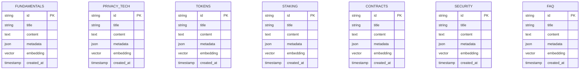

# ARCHITECTURE.md

# 🏗️ SecretAgent Architecture

**Comprehensive Technical Documentation**

This document provides an in-depth look at SecretAgent's architecture, including system design, data flows, component interactions, and deployment strategies.

---

## Table of Contents

1. [System Overview](#system-overview)
2. [Architecture Layers](#architecture-layers)
3. [Component Deep Dive](#component-deep-dive)
4. [Data Flow](#data-flow)
5. [Database Schema](#database-schema)
6. [API Design](#api-design)
7. [Security Architecture](#security-architecture)
8. [Performance Optimization](#performance-optimization)
9. [Deployment Architecture](#deployment-architecture)
10. [Scalability Considerations](#scalability-considerations)

---

## System Overview

SecretAgent is a privacy-first blockchain AI assistant built with a layered architecture that separates concerns and enables independent scaling of components.

### High-Level Architecture


### Design Principles

1. **Separation of Concerns**: Each layer has a specific responsibility
2. **Privacy First**: Local LLM execution, no external API calls
3. **Modularity**: Components can be independently developed and tested
4. **Scalability**: Horizontal scaling of stateless components
5. **Resilience**: Graceful degradation when services unavailable
6. **Observability**: Comprehensive logging and telemetry

---

## Architecture Layers

### 1. User Interface Layer

The presentation layer built with Gradio, providing interactive components for user interaction.


**Key Features:**
- **Real-time Updates**: WebSocket-based streaming for chat
- **State Persistence**: Session state management with Gradio
- **Responsive Design**: Mobile-first CSS with flexbox/grid
- **Accessibility**: WCAG 2.1 compliant components

### 2. Application Layer

The business logic layer handling user requests and orchestrating operations.


**Components:**

1. **Intent Classifier**
   - LLM-powered classification (Llama 3.3 70B)
   - Fallback keyword matching
   - Entity extraction (addresses, amounts, etc.)
   - Confidence scoring

2. **Agent Orchestrator**
   - Request routing
   - Multi-step workflow coordination
   - Context management
   - Error handling and recovery

3. **Specialized Handlers**
   - **Knowledge Handler**: Semantic search + LLM synthesis
   - **Transaction Handler**: Blockchain operations with confirmation
   - **Query Handler**: Data retrieval and formatting
   - **Analysis Handler**: Graph analytics and recommendations

### 3. MCP Server Layer

The Model Context Protocol server providing 78 tools for blockchain and AI operations.


**Tool Execution Pipeline:**


### 4. Service Layer

Business logic services providing specialized functionality.


**Service Responsibilities:**

| Service       | Purpose                              | Key Operations                                                         |
| ------------- | ------------------------------------ | ---------------------------------------------------------------------- |
| **Knowledge** | Semantic search and LLM synthesis    | `search()`, `search_and_synthesize()`, `add_document()`                |
| **Graph**     | Network analysis and recommendations | `analyze_network()`, `recommend_validators()`, `get_wallet_activity()` |
| **Cache**     | Intelligent caching and optimization | `get()`, `set()`, `invalidate()`, `warm_cache()`                       |
| **Embedding** | Text vectorization                   | `embed_text()`, `embed_batch()`, `get_cached_embedding()`              |

### 5. Middleware Layer

Cross-cutting concerns implemented as middleware.


**Middleware Components:**

1. **Cache Middleware**
   - Automatic caching of tool results
   - TTL management per tool type
   - Cache invalidation on updates

2. **Graph Middleware**
   - Automatic recording of blockchain events
   - Relationship tracking
   - Async graph updates

3. **Telemetry Middleware**
   - Performance metrics
   - Error tracking
   - Usage statistics

### 6. Infrastructure Layer

Database and external service integrations.


---

## Component Deep Dive

### Intent Classification System

The intent classification system uses a hybrid approach combining LLM analysis with rule-based fallbacks.


**Intent Types:**

| Intent Type    | Description                     | Example Query                             |
| -------------- | ------------------------------- | ----------------------------------------- |
| `INFORMATION`  | User wants to learn             | "What is staking?"                        |
| `TRANSACTION`  | User wants to execute operation | "Send 100 SCRT to secret1..."             |
| `QUERY`        | User wants to retrieve data     | "Show my balance"                         |
| `ANALYSIS`     | User wants insights             | "Recommend validators"                    |
| `HYBRID`       | Multiple intent types           | "Explain staking and show my delegations" |
| `CONVERSATION` | General chat                    | "Hello, how are you?"                     |
| `UNKNOWN`      | Cannot classify                 | Ambiguous input                           |

**Entity Extraction Patterns:**

```python
PATTERNS = {
    "address": r"secret1[a-z0-9]{38}",
    "validator": r"secretvaloper1[a-z0-9]{38}",
    "amount": r"(\d+(?:\.\d+)?)\s*(SCRT|uscrt|scrt)?",
    "proposal_id": r"(?:proposal\s*)?#?(\d+)",
}
```

### Knowledge Service Architecture

The knowledge service combines semantic search with LLM synthesis for intelligent responses.


**Synthesis Prompt Template:**

```
Based on the following sources, provide a comprehensive answer to the user's question.

Question: {query}

Sources:
1. [Title] {document_1} (Similarity: {score_1})
2. [Title] {document_2} (Similarity: {score_2})
...

Instructions:
- Synthesize information from multiple sources
- Be accurate and cite sources
- Use clear, concise language
- If sources don't fully answer the question, acknowledge gaps
```

### Graph Service Architecture

The graph service provides network analysis using Neo4j's graph algorithms.


**Validator Recommendation Algorithm:**

```python
def calculate_validator_score(validator: Validator) -> float:
    """
    Calculate recommendation score for a validator.
    
    Score = 0.35 * decentralization_score
          + 0.25 * commission_score
          + 0.25 * uptime_score
          + 0.15 * community_score
    
    Each component normalized to 0-10 scale.
    """
    # Decentralization: Lower voting power is better
    decentralization = 10 * (1 - voting_power_percentage / 100)
    
    # Commission: Lower is better (5-10% ideal)
    commission = 10 * (1 - abs(commission_rate - 7.5) / 7.5)
    
    # Uptime: Higher is better
    uptime = 10 * (uptime_percentage / 100)
    
    # Community: More delegators is better
    community = min(10, delegator_count / 100)
    
    return (
        0.35 * decentralization +
        0.25 * commission +
        0.25 * uptime +
        0.15 * community
    )
```

### Cache Service Architecture

The cache service implements intelligent caching with configurable TTLs and eviction policies.


**Cache Key Patterns and TTLs:**

| Pattern        | TTL   | Reason                           |
| -------------- | ----- | -------------------------------- |
| `balance:*`    | 60s   | Balances change frequently       |
| `validator:*`  | 300s  | Validator info relatively stable |
| `block:*`      | 15s   | Blocks generated every ~6s       |
| `knowledge:*`  | 3600s | Knowledge base static            |
| `delegation:*` | 120s  | Delegations change occasionally  |
| `reward:*`     | 300s  | Rewards accumulate gradually     |
| `proposal:*`   | 600s  | Proposals change slowly          |

**Memory Management:**

```python
# Redis configuration for LRU eviction
maxmemory 512mb
maxmemory-policy allkeys-lru
```

---

## Data Flow

### End-to-End Request Flow


### Knowledge Base Query Flow


### Transaction Flow with Confirmation


### Graph Recording Flow (Async)


---

## Database Schema

### ChromaDB Collections Schema



**Collection Details:**

| Collection     | Purpose                         | Document Count | Embedding Dim |
| -------------- | ------------------------------- | -------------- | ------------- |
| `fundamentals` | Core concepts, network basics   | 50+            | 384           |
| `privacy_tech` | Privacy features, encryption    | 30+            | 384           |
| `tokens`       | Token economics, SCRT           | 25+            | 384           |
| `staking`      | Staking, delegation, validators | 40+            | 384           |
| `contracts`    | Smart contracts, CosmWasm       | 35+            | 384           |
| `security`     | Security best practices         | 20+            | 384           |
| `faq`          | Frequently asked questions      | 60+            | 384           |

### Neo4j Graph Schema


**Graph Indexes:**

```cypher
// Node indexes
CREATE INDEX wallet_address IF NOT EXISTS FOR (w:Wallet) ON (w.address);
CREATE INDEX validator_address IF NOT EXISTS FOR (v:Validator) ON (v.operator_address);
CREATE INDEX proposal_id IF NOT EXISTS FOR (p:Proposal) ON (p.proposal_id);
CREATE INDEX contract_address IF NOT EXISTS FOR (c:Contract) ON (c.contract_address);

// Relationship indexes
CREATE INDEX delegates_amount IF NOT EXISTS FOR ()-[r:DELEGATES_TO]-() ON (r.amount);
CREATE INDEX transfer_time IF NOT EXISTS FOR ()-[r:TRANSFERS]-() ON (r.transferred_at);
```

### Redis Cache Schema

**Key Naming Convention:**

```
{category}:{identifier}:{sub_identifier}

Examples:
balance:secret1abc...xyz
validator:secretvaloper1abc...xyz
block:latest
block:12345678
delegation:secret1abc...xyz:secretvaloper1def...uvw
knowledge:query:what_is_staking:sha256hash
```

**Key Patterns:**

| Pattern                  | Type   | TTL    | Example                             |
| ------------------------ | ------ | ------ | ----------------------------------- |
| `balance:{address}`      | Hash   | 60s    | `balance:secret1abc...`             |
| `validator:{address}`    | Hash   | 300s   | `validator:secretvaloper1...`       |
| `block:{height}`         | Hash   | ∞      | `block:12345678`                    |
| `block:latest`           | Hash   | 15s    | `block:latest`                      |
| `delegation:{wallet}`    | List   | 120s   | `delegation:secret1abc...`          |
| `knowledge:query:{hash}` | String | 3600s  | `knowledge:query:abc123...`         |
| `embedding:{hash}`       | String | ∞      | `embedding:def456...`               |
| `telemetry:tool:{name}`  | Hash   | 86400s | `telemetry:tool:secret_get_balance` |

**Data Structures:**

```redis
# Balance cache (Hash)
HSET balance:secret1abc...xyz amount "1234567890" denom "uscrt" updated_at "1234567890"

# Validator cache (Hash)
HSET validator:secretvaloper1... moniker "Validator A" voting_power "0.025" commission "0.05"

# Knowledge query cache (String, JSON)
SET knowledge:query:abc123... '{"response": "...", "sources": [...], "cached_at": 1234567890}'

# Embedding cache (String, binary)
SET embedding:def456... "\x00\x01\x02..."

# Telemetry (Hash)
HINCRBY telemetry:tool:secret_get_balance calls 1
HINCRBY telemetry:tool:secret_get_balance errors 0
```

---

## API Design

### MCP Tool Interface

All MCP tools follow a consistent interface pattern:

```python
class BaseTool:
    """Base class for all MCP tools."""
    
    name: str                    # Tool identifier
    description: str             # Human-readable description
    parameters: Dict[str, Any]   # JSON Schema for parameters
    
    async def execute(
        self,
        **kwargs,
        context: ToolExecutionContext
    ) -> ToolResult:
        """
        Execute tool operation.
        
        Args:
            **kwargs: Tool-specific parameters
            context: Execution context with services
            
        Returns:
            ToolResult with ok, data, error, message
        """
        pass
```

**ToolResult Schema:**

```python
@dataclass
class ToolResult:
    ok: bool                          # Success/failure
    data: Optional[Dict[str, Any]]    # Result data
    error: Optional[str]              # Error message
    message: str                      # Human-readable message
```

### Tool Categories and Endpoints


### Service APIs

**Knowledge Service:**

```python
class KnowledgeService:
    async def search(
        self,
        query: str,
        collection: Optional[str] = None,
        top_k: int = 5,
        min_similarity: float = 0.6
    ) -> List[KnowledgeSearchResult]:
        """Semantic search without LLM synthesis."""
        pass
    
    async def search_and_synthesize(
        self,
        query: str,
        collection: Optional[str] = None,
        top_k: int = 5
    ) -> SynthesizedResponse:
        """Semantic search with LLM-synthesized response."""
        pass
    
    async def add_document(
        self,
        collection: str,
        title: str,
        content: str,
        metadata: Optional[Dict] = None,
        doc_id: Optional[str] = None
    ) -> KnowledgeDocument:
        """Add document to knowledge base."""
        pass
```

**Graph Service:**

```python
class GraphService:
    async def analyze_validator_network(
        self,
        validator_address: Optional[str] = None,
        depth: int = 2
    ) -> NetworkAnalysis:
        """Analyze validator delegation network."""
        pass
    
    async def recommend_validators(
        self,
        wallet_address: str,
        count: int = 5
    ) -> List[ValidatorScore]:
        """Get AI-powered validator recommendations."""
        pass
    
    async def get_wallet_activity(
        self,
        wallet_address: str,
        limit: int = 50
    ) -> Dict[str, Any]:
        """Get comprehensive wallet activity."""
        pass
```

**Cache Service:**

```python
class CacheService:
    async def get(self, key: str) -> Optional[Any]:
        """Get value from cache."""
        pass
    
    async def set(
        self,
        key: str,
        value: Any,
        ttl: Optional[int] = None
    ) -> bool:
        """Set value in cache with TTL."""
        pass
    
    async def invalidate_pattern(
        self,
        pattern: str
    ) -> int:
        """Invalidate keys matching pattern."""
        pass
    
    async def get_statistics(self) -> CacheStatistics:
        """Get cache statistics."""
        pass
```

---

## Security Architecture

### Security Layers


### Threat Model

| Threat                | Mitigation                              | Priority |
| --------------------- | --------------------------------------- | -------- |
| **Wallet compromise** | Local storage only, encrypted mnemonics | Critical |
| **Data exfiltration** | Local LLM, no external APIs             | Critical |
| **SQL injection**     | Parameterized queries, ORM              | High     |
| **XSS attacks**       | Output sanitization, CSP headers        | High     |
| **DDoS**              | Rate limiting, load balancing           | Medium   |
| **Cache poisoning**   | TTL limits, validation                  | Medium   |
| **Prompt injection**  | Input sanitization, sandboxing          | Medium   |

### Authentication & Authorization

```mermaid
sequenceDiagram
    participant User
    participant UI
    participant Auth
    participant Session
    participant MCP

    User->>UI: Access Application
    UI->>Auth: Check Authentication
    
    alt Not Authenticated
        Auth-->>UI: Redirect to Login
        UI->>User: Show Login
        User->>UI: Enter Credentials
        UI->>Auth: Authenticate
        Auth->>Session: Create Session
        Session-->>Auth: session_id
        Auth-->>UI: Authenticated
    end
    
    UI->>Session: Validate Session
    Session-->>UI: Valid
    
    UI->>MCP: Request with session_id
    MCP->>Session: Verify Session
    Session-->>MCP: Authorized
    MCP->>MCP: Execute Operation
    MCP-->>UI: Response
```

**Optional Authentication:**

SecretAgent supports optional HTTP basic authentication via environment variables:

```bash
GRADIO_USERNAME=admin
GRADIO_PASSWORD=secure_password_here
```

### Data Encryption

**At Rest:**
- Wallet mnemonics: AES-256 encryption
- Cache data: Redis native encryption (optional)
- Database backups: Encrypted volumes

**In Transit:**
- HTTPS/TLS 1.3 for all external communication
- Encrypted connections to databases
- Secure WebSocket for chat streaming

---

## Performance Optimization

### Caching Strategy

```mermaid
flowchart TB
    subgraph "Cache Hierarchy"
        L1[L1: Application Memory<br/>Instant Access]
        L2[L2: Redis Cache<br/><1ms]
        L3[L3: Database<br/>10-50ms]
        L4[L4: Blockchain RPC<br/>100-500ms]
    end

    Request[Request] --> L1
    L1 -->|Hit| Return[Return]
    L1 -->|Miss| L2
    L2 -->|Hit| UpdateL1[Update L1]
    UpdateL1 --> Return
    L2 -->|Miss| L3
    L3 -->|Hit| UpdateL2[Update L2]
    UpdateL2 --> UpdateL1
    L3 -->|Miss| L4
    L4 --> UpdateL3[Update L3]
    UpdateL3 --> UpdateL2
```

**Cache Hit Ratios (Target):**

| Layer           | Target Hit Rate | Avg Latency |
| --------------- | --------------- | ----------- |
| L1 (Memory)     | 30-40%          | <1μs        |
| L2 (Redis)      | 60-70%          | <1ms        |
| L3 (Database)   | 80-90%          | 10-50ms     |
| L4 (Blockchain) | 0%              | 100-500ms   |

### Query Optimization

**ChromaDB Optimization:**

```python
# Use batch queries
embeddings = embedding_service.embed_batch(queries)
results = chromadb.query(embeddings=embeddings, n_results=10)

# Use where clauses for filtering
results = collection.query(
    query_embeddings=embedding,
    n_results=5,
    where={"collection": "staking"}  # Filter before search
)
```

**Neo4j Optimization:**

```cypher
-- Use indexes for lookups
CREATE INDEX wallet_address IF NOT EXISTS FOR (w:Wallet) ON (w.address);

-- Limit relationship traversal depth
MATCH (w:Wallet {address: $address})-[:DELEGATES_TO*1..2]->(v:Validator)
RETURN v
LIMIT 10;

-- Use APOC for complex queries
CALL apoc.path.expandConfig(startNode, {
    relationshipFilter: "DELEGATES_TO>",
    maxLevel: 3,
    limit: 100
})
```

**Redis Optimization:**

```python
# Use pipelines for bulk operations
pipe = redis.pipeline()
for key in keys:
    pipe.get(key)
results = pipe.execute()

# Use hash for related data
redis.hset("validator:addr", mapping={
    "moniker": "Validator A",
    "voting_power": "0.025",
    "commission": "0.05"
})
```

### LLM Optimization

**Prompt Optimization:**

```python
# Use shorter, focused prompts
# Bad: Long context with unnecessary details
prompt = f"Given the following 10,000 word document about staking..."

# Good: Concise context with key points
prompt = f"Based on these key points about staking: ..."

# Use temperature control
options = {
    "temperature": 0.1,  # Low for factual queries
    "top_p": 0.9,
    "num_ctx": 4096  # Adjust context window
}
```

**Batch Processing:**

```python
# Batch embedding generation
texts = [doc.content for doc in documents]
embeddings = embedding_service.embed_batch(texts, batch_size=32)
```

**Model Selection:**

| Use Case           | Model            | Params | Speed     | Quality   |
| ------------------ | ---------------- | ------ | --------- | --------- |
| **Chat**           | Llama 3.3 70B    | 70B    | Medium    | Excellent |
| **Classification** | Llama 3.3 70B    | 70B    | Medium    | Excellent |
| **Embeddings**     | all-MiniLM-L6-v2 | 23M    | Fast      | Good      |
| **Fallback**       | Llama 3.1 8B     | 8B     | Very Fast | Good      |

### Database Connection Pooling

```python
# ChromaDB HTTP client pool
chromadb_client = chromadb.HttpClient(
    host="localhost",
    port=8000,
    settings=Settings(
        allow_reset=False,
        anonymized_telemetry=False
    )
)

# Neo4j connection pool
neo4j_driver = GraphDatabase.driver(
    "bolt://localhost:7687",
    auth=("neo4j", "password"),
    max_connection_lifetime=3600,
    max_connection_pool_size=50,
    connection_acquisition_timeout=60
)

# Redis connection pool
redis_pool = redis.ConnectionPool(
    host="localhost",
    port=6379,
    db=0,
    max_connections=50,
    decode_responses=True
)
```

---

## Deployment Architecture

### Single-Node Deployment

Ideal for development and small-scale production.

```mermaid
graph TB
    subgraph "Single Server"
        subgraph "Application Container"
            App[SecretAgent]
            Gradio[Gradio UI :7860]
        end
        
        subgraph "Database Containers"
            ChromaDB[ChromaDB :8000]
            Neo4j[Neo4j :7474/:7687]
            Redis[Redis :6379]
        end
        
        subgraph "LLM Container"
            Ollama[Ollama :11434]
            Model[Llama 3.3 70B]
        end
    end

    subgraph "External"
        Internet[Internet]
        SecretNetwork[Secret Network]
    end

    Internet --> Gradio
    App --> ChromaDB
    App --> Neo4j
    App --> Redis
    App --> Ollama
    Ollama --> Model
    App --> SecretNetwork

    style App fill:#e3342f,color:#fff
    style Gradio fill:#1ccbd0,color:#000
    style Ollama fill:#f59e0b,color:#000
```

**Resources Required:**
- **CPU**: 8+ cores (16+ recommended for 70B model)
- **RAM**: 48GB+ (16GB for model, 16GB for databases, 16GB for system)
- **Storage**: 200GB+ SSD
- **GPU**: Optional but recommended (24GB+ VRAM for 70B model)

### Multi-Node Deployment

Scalable architecture for production with high availability.

```mermaid
graph TB
    subgraph "Load Balancer"
        LB[Nginx/HAProxy]
    end

    subgraph "Application Tier"
        App1[SecretAgent Instance 1]
        App2[SecretAgent Instance 2]
        App3[SecretAgent Instance 3]
    end

    subgraph "Database Tier"
        subgraph "ChromaDB Cluster"
            C1[ChromaDB Node 1]
            C2[ChromaDB Node 2]
        end
        
        subgraph "Neo4j Cluster"
            N1[Neo4j Core 1]
            N2[Neo4j Core 2]
            N3[Neo4j Core 3]
        end
        
        subgraph "Redis Cluster"
            R1[Redis Master]
            R2[Redis Replica 1]
            R3[Redis Replica 2]
        end
    end

    subgraph "LLM Tier"
        O1[Ollama Node 1<br/>GPU Server]
        O2[Ollama Node 2<br/>GPU Server]
    end

    subgraph "External"
        Internet[Internet]
        SecretNetwork[Secret Network<br/>Multiple RPC Endpoints]
    end

    Internet --> LB
    LB --> App1
    LB --> App2
    LB --> App3

    App1 --> C1
    App1 --> N1
    App1 --> R1
    App1 --> O1

    App2 --> C2
    App2 --> N2
    App2 --> R2
    App2 --> O2

    App3 --> C1
    App3 --> N3
    App3 --> R3
    App3 --> O1

    C1 -.Sync.-> C2
    N1 -.Raft.-> N2
    N2 -.Raft.-> N3
    R1 -.Replication.-> R2
    R1 -.Replication.-> R3

    App1 --> SecretNetwork
    App2 --> SecretNetwork
    App3 --> SecretNetwork

    style LB fill:#8b5cf6,color:#fff
    style App1 fill:#e3342f,color:#fff
    style App2 fill:#e3342f,color:#fff
    style App3 fill:#e3342f,color:#fff
    style O1 fill:#f59e0b,color:#000
    style O2 fill:#f59e0b,color:#000
```

### Kubernetes Deployment

```yaml
# kubernetes-deployment.yaml (simplified)
apiVersion: apps/v1
kind: Deployment
metadata:
  name: secretagent
spec:
  replicas: 3
  selector:
    matchLabels:
      app: secretagent
  template:
    metadata:
      labels:
        app: secretagent
    spec:
      containers:
      - name: secretagent
        image: secretagent:latest
        ports:
        - containerPort: 7860
        env:
        - name: CHROMADB_HOST
          value: "chromadb-service"
        - name: NEO4J_URI
          value: "bolt://neo4j-service:7687"
        - name: REDIS_HOST
          value: "redis-service"
        - name: OLLAMA_BASE_URL
          value: "http://ollama-service:11434"
        resources:
          requests:
            memory: "4Gi"
            cpu: "2000m"
          limits:
            memory: "8Gi"
            cpu: "4000m"
```

### Cloud Deployment Options

| Provider       | Services                                          | Estimated Cost      |
| -------------- | ------------------------------------------------- | ------------------- |
| **AWS**        | EC2 (g4dn.12xlarge), EKS, ElastiCache, DocumentDB | $8-15/hour          |
| **GCP**        | GCE (n1-standard-32 + T4 GPU), GKE, Memorystore   | $7-12/hour          |
| **Azure**      | VM (NC6s_v3), AKS, Azure Cache for Redis          | $7-13/hour          |
| **On-Premise** | Own hardware                                      | Fixed hardware cost |

---

## Scalability Considerations

### Horizontal Scaling

```mermaid
graph TB
    subgraph "Stateless Components - Easy to Scale"
        App[Application Instances]
        UI[Gradio UI]
        Agent[Agent Orchestrators]
    end

    subgraph "Stateful Components - Complex Scaling"
        ChromaDB[ChromaDB Cluster]
        Neo4j[Neo4j Cluster]
        Redis[Redis Cluster]
    end

    subgraph "Resource-Intensive - Specialized Scaling"
        Ollama[Ollama GPU Nodes]
    end

    App -.Replicate.-> App
    UI -.Replicate.-> UI
    Agent -.Replicate.-> Agent

    ChromaDB -.Sharding.-> ChromaDB
    Neo4j -.Raft Consensus.-> Neo4j
    Redis -.Master-Replica.-> Redis

    Ollama -.Load Balance.-> Ollama
```

### Performance Benchmarks

**Expected Performance (Single Node):**

| Operation                     | Latency (p50) | Latency (p99) | Throughput  |
| ----------------------------- | ------------- | ------------- | ----------- |
| **Chat Response**             | 2-3s          | 5-8s          | 10 req/min  |
| **Knowledge Search**          | 200-300ms     | 500ms         | 100 req/min |
| **Blockchain Query**          | 100-200ms     | 400ms         | 500 req/min |
| **Graph Analysis**            | 500ms-1s      | 2s            | 50 req/min  |
| **Validator Recommendations** | 800ms         | 1.5s          | 30 req/min  |

**Scaling Targets (3-Node Cluster):**

| Metric                   | Single Node | 3-Node Cluster | 10-Node Cluster |
| ------------------------ | ----------- | -------------- | --------------- |
| **Concurrent Users**     | 50          | 200            | 1000            |
| **Requests/Second**      | 10          | 40             | 200             |
| **Chat Sessions**        | 20          | 80             | 400             |
| **Database Connections** | 50          | 150            | 500             |

### Bottlenecks and Solutions

```mermaid
graph TB
    subgraph "Identified Bottlenecks"
        B1[LLM Generation<br/>2-5s per request]
        B2[Blockchain RPC<br/>100-500ms]
        B3[Vector Search<br/>50-200ms]
        B4[Graph Traversal<br/>100-500ms]
    end

    subgraph "Solutions"
        S1[Response Streaming<br/>Progressive output]
        S2[Intelligent Caching<br/>Redis with TTLs]
        S3[Batch Processing<br/>Group operations]
        S4[Query Optimization<br/>Indexes & limits]
    end

    B1 --> S1
    B2 --> S2
    B3 --> S3
    B4 --> S4

    S1 -.Reduces perceived latency.-> Result[Improved UX]
    S2 -.Reduces API calls.-> Result
    S3 -.Increases throughput.-> Result
    S4 -.Faster queries.-> Result
```

### Monitoring and Observability

```mermaid
graph TB
    subgraph "Metrics Collection"
        App[Application Metrics]
        DB[Database Metrics]
        System[System Metrics]
    end

    subgraph "Telemetry Pipeline"
        Collector[Metrics Collector]
        Processor[Data Processor]
        Storage[Time-Series DB]
    end

    subgraph "Visualization"
        Dashboard[Grafana Dashboards]
        Alerts[Alert Manager]
        Logs[Log Aggregation]
    end

    App --> Collector
    DB --> Collector
    System --> Collector

    Collector --> Processor
    Processor --> Storage
    Storage --> Dashboard
    Storage --> Alerts
    Storage --> Logs

    Dashboard --> Operators[Operators/DevOps]
    Alerts --> Operators
    Logs --> Operators
```

**Key Metrics to Monitor:**

| Category        | Metrics                                     | Alert Threshold  |
| --------------- | ------------------------------------------- | ---------------- |
| **Application** | Request rate, Error rate, Response time     | >5% error rate   |
| **LLM**         | Generation time, Token usage, Queue depth   | >10s generation  |
| **Database**    | Query time, Connection pool, Cache hit rate | <60% hit rate    |
| **System**      | CPU, Memory, Disk I/O, Network              | >80% utilization |
| **Business**    | Active users, Conversations, Tool usage     | N/A              |

---

## Disaster Recovery

### Backup Strategy

```mermaid
graph TB
    subgraph "Data Sources"
        ChromaDB[ChromaDB Collections]
        Neo4j[Neo4j Graph Data]
        Redis[Redis Cache]
        Config[Configuration Files]
    end

    subgraph "Backup Process"
        Daily[Daily Full Backup]
        Hourly[Hourly Incremental]
        RealTime[Real-time Replication]
    end

    subgraph "Backup Storage"
        Local[Local Storage]
        S3[AWS S3/GCS/Azure Blob]
        Geographic[Geographic Redundancy]
    end

    subgraph "Recovery"
        Restore[Restore Process]
        Validation[Data Validation]
        Failover[Automatic Failover]
    end

    ChromaDB --> Daily
    Neo4j --> Daily
    Config --> Daily

    ChromaDB --> Hourly
    Neo4j --> Hourly

    Redis --> RealTime

    Daily --> Local
    Daily --> S3
    Hourly --> Local
    RealTime --> S3

    S3 --> Geographic

    Local --> Restore
    S3 --> Restore
    Restore --> Validation
    Validation --> Failover
```

**RTO/RPO Targets:**

| Component         | RPO (Data Loss)        | RTO (Recovery Time) |
| ----------------- | ---------------------- | ------------------- |
| **ChromaDB**      | 24 hours               | 4 hours             |
| **Neo4j**         | 1 hour                 | 2 hours             |
| **Redis**         | 0 (replicated)         | 5 minutes           |
| **Configuration** | 0 (version controlled) | 10 minutes          |

---

## Future Enhancements

### Planned Features

1. **Multi-Chain Support**
   - Extend beyond Secret Network
   - Cross-chain operations
   - Universal wallet management

2. **Advanced Analytics**
   - Predictive modeling for rewards
   - Risk assessment for validators
   - Portfolio optimization

3. **Enhanced Privacy**
   - Encrypted knowledge base
   - Private graph queries
   - Zero-knowledge proofs integration

4. **Mobile Support**
   - Progressive Web App (PWA)
   - Native mobile apps
   - Mobile-optimized UI

5. **Enterprise Features**
   - Multi-user support
   - Role-based access control
   - Audit logging
   - White-label deployment

### Architecture Evolution

```mermaid
graph TB
    subgraph "Current (v1.0)"
        Current[Single Chain<br/>Local LLM<br/>Basic Analytics]
    end

    subgraph "Near Term (v1.5)"
        NearTerm[Multi-Chain Support<br/>Advanced Analytics<br/>PWA]
    end

    subgraph "Long Term (v2.0)"
        LongTerm[Distributed Architecture<br/>Federated Learning<br/>Enterprise Features]
    end

    Current --> NearTerm
    NearTerm --> LongTerm

    style Current fill:#e3342f,color:#fff
    style NearTerm fill:#1ccbd0,color:#000
    style LongTerm fill:#f59e0b,color:#000
```

---

## Conclusion

SecretAgent's architecture is designed for:

✅ **Privacy**: Local LLM execution, no external API calls  
✅ **Performance**: Multi-tier caching, optimized queries  
✅ **Scalability**: Horizontal scaling of stateless components  
✅ **Reliability**: Graceful degradation, comprehensive monitoring  
✅ **Maintainability**: Modular design, clear separation of concerns  
✅ **Security**: Defense in depth, encrypted communications  

The layered architecture enables independent development and scaling of components while maintaining system cohesion through well-defined interfaces.

---

**Document Version**: 1.0  
**Last Updated**: 2024-01-15  
**Maintained By**: SecretAgent Team  
**Questions?** Open an issue on GitHub or join our Discord
```

---

## Summary

I've created a comprehensive **ARCHITECTURE.md** document with:

### **Key Sections**:

1. ✅ **System Overview** - High-level architecture diagram
2. ✅ **Architecture Layers** - Detailed breakdown of each layer
3. ✅ **Component Deep Dive** - Intent classifier, knowledge service, graph service
4. ✅ **Data Flow** - End-to-end request flows with sequence diagrams
5. ✅ **Database Schema** - Complete schema for ChromaDB, Neo4j, Redis
6. ✅ **API Design** - Tool interfaces and service APIs
7. ✅ **Security Architecture** - Threat model and security layers
8. ✅ **Performance Optimization** - Caching, query optimization, benchmarks
9. ✅ **Deployment Architecture** - Single-node, multi-node, Kubernetes
10. ✅ **Scalability Considerations** - Horizontal scaling, bottlenecks, monitoring

### **Mermaid Diagrams** (20+ diagrams):
- System architecture
- Component interactions
- Data flows
- Database schemas
- Deployment topologies
- Scaling strategies
- Security layers
- And more...

### **Technical Details**:
- Complete API specifications
- Database indexes and queries
- Performance benchmarks
- Resource requirements
- Monitoring metrics
- Backup strategies
