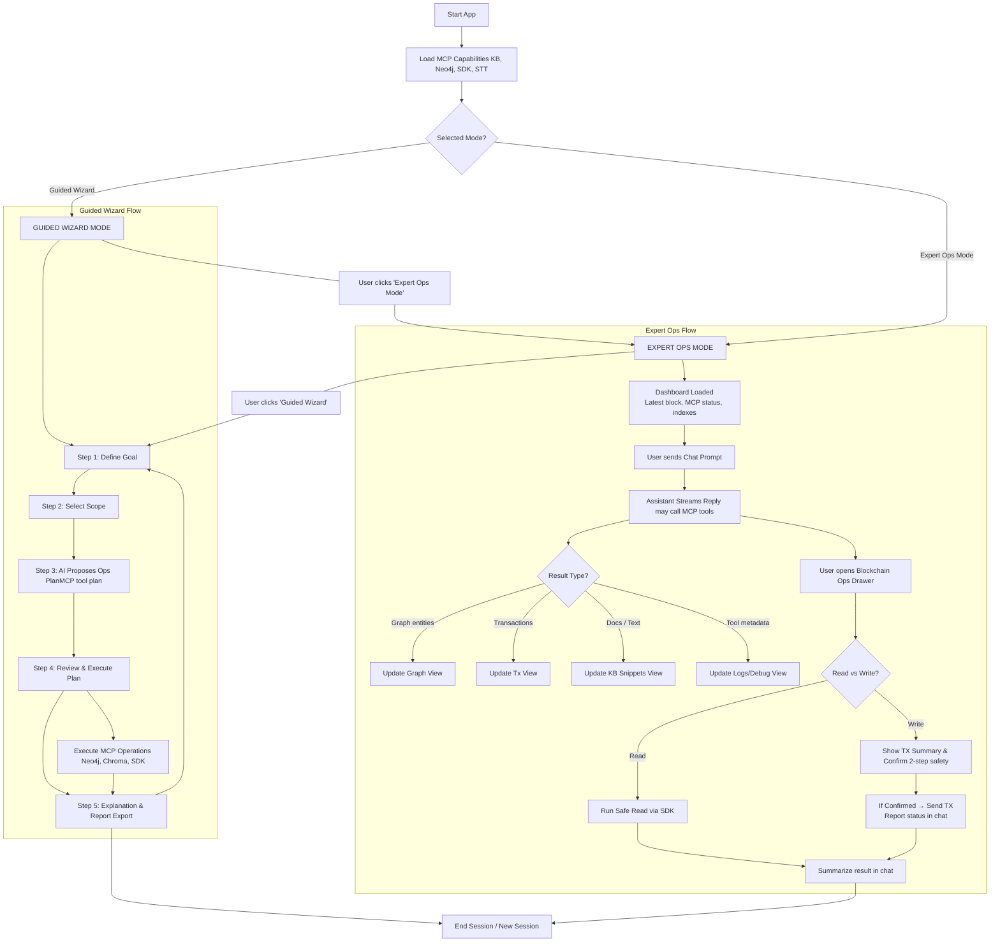
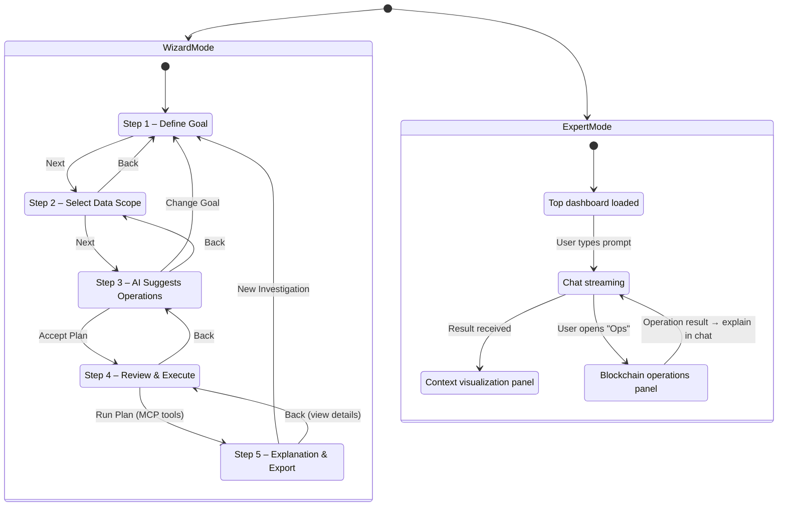
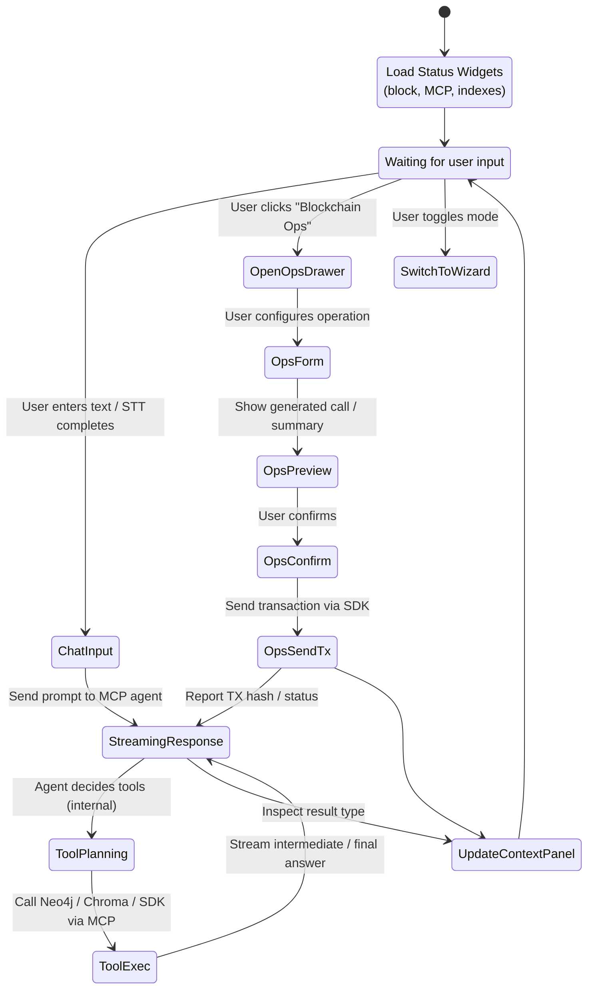
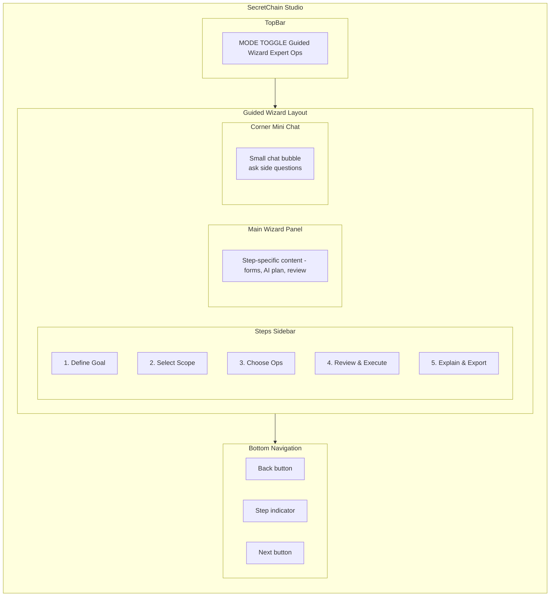
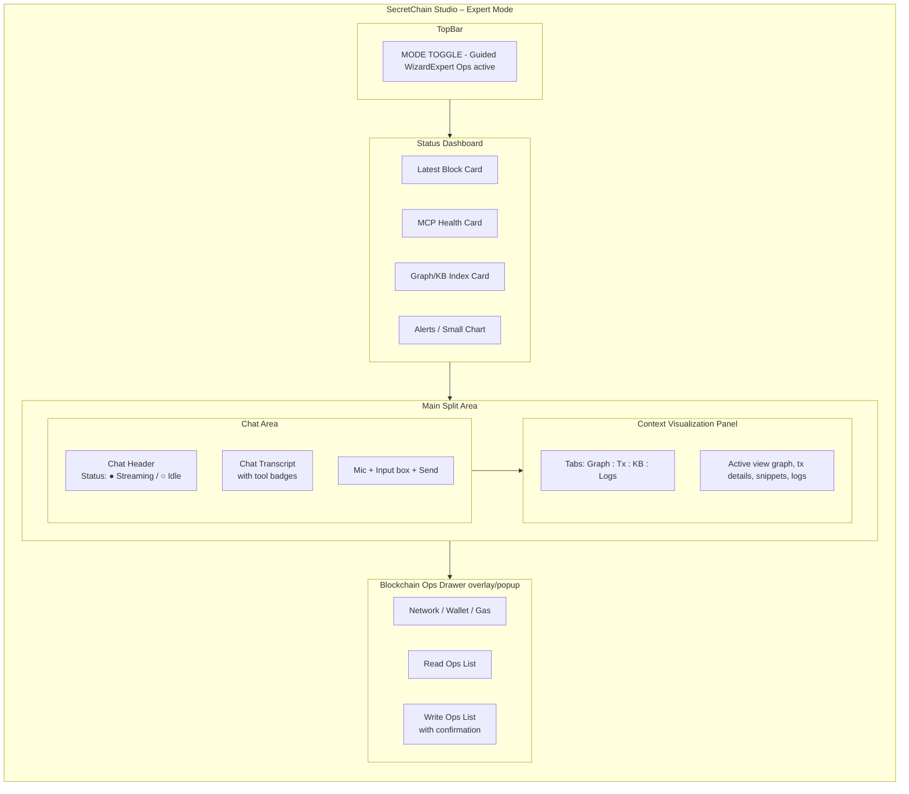

Mermaid diagrams for:

1. Overall **mode + flow**
2. **Wizard states**
3. **Expert mode states**
4. **Wireframe-style layout** for both modes

---

## 1. High-Level User Flow (Modes + Main Paths)

---

## 2. Wizard as a State Machine

---

## 3. Expert Mode Interaction Flow (State / Events)

This one zooms into Expert mode behavior.

---

## 4. Wireframe-Level Layout — Guided Wizard

Mermaid isn’t a full wireframing tool, but we can use `subgraph` + layout hints as a structural wireframe.

---

## 5. Wireframe-Level Layout — Expert Mode (Ops Dashboard + Chat Hybrid)

